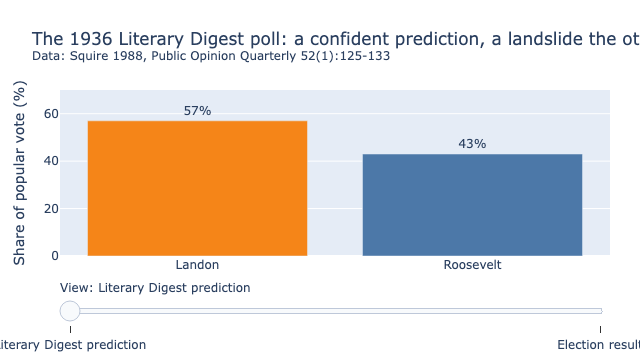
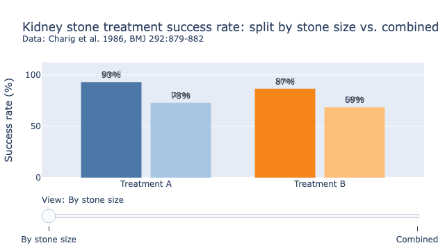
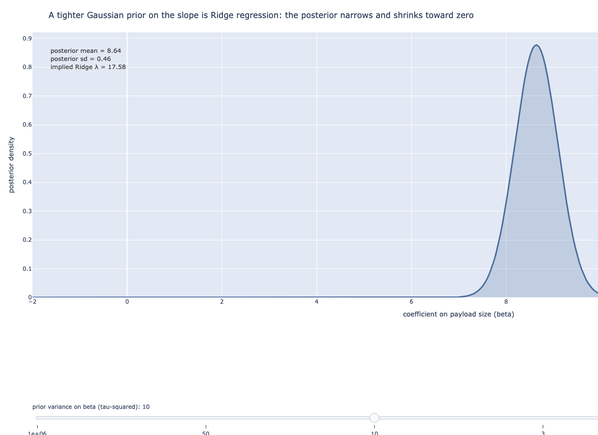

# Applied Statistics for Data Science, Machine Learning, and AI Engineers


**A free, open-source statistics book where every chart is a slider, not a screenshot.**

[](https://rudrendupaul.github.io/python-statistics-for-data-science-ml-ai-engineers/)

[](LICENSE)
[](LICENSE-CODE)
[](https://quarto.org/)
[](https://orcid.org/0009-0008-0141-4690)

**Live book:** https://rudrendupaul.github.io/python-statistics-for-data-science-ml-ai-engineers/

---

## Why this book exists

Most statistics books show you a chart and ask you to imagine what happens when a parameter changes. This one does not ask you to imagine anything. Every figure in every chapter is a live Plotly chart with a slider built into the page. Drag the contamination slider in Chapter 1 and watch a checkout API's mean chase after a slow tail while the median refuses to move. Drag the sample-size slider in Chapter 9 and watch a Bayesian posterior narrow in front of you, in your browser, with no server and no setup.

The book runs one story through fifteen chapters: simulated response times for a checkout API, followed from a first histogram through hypothesis tests, regression, cross-validation, tree-based models, gradient boosting, and a full second pass through the same ground in Bayesian terms, ending in a Bayesian A/B test deciding whether a redesign should ship. Two historical case studies, the 1936 Literary Digest election poll and Charig et al.'s 1986 kidney-stone study, anchor the sections on sampling bias and Simpson's paradox with numbers you can check instead of numbers made up for the occasion.

Every chapter is plain Markdown. Every figure has a matching Python script that generated it, sitting in the same folder as the prose. Nothing here is a black box.

## Who is this book for

- Data scientists who know how to call `.fit()` but want to know what the number underneath it means
- Machine learning engineers who want the Bayesian counterpart to the classical method they use (Ridge regression's Gaussian prior, a random forest's BART equivalent, a fixed-horizon A/B test's Bayesian alternative)
- AI engineers who need to reason about uncertainty, not just point predictions
- Anyone who has sat through a statistics course that stayed abstract and wants the same material tied to a running production example

## What this book covers

- Descriptive statistics and why the wrong summary number is the most common way a report misleads a reader
- Hypothesis testing, statistical power, and the difference between a p-value and the probability the null hypothesis is true
- Probability distributions, from the base-rate fallacy to the Central Limit Theorem
- Regression modeling: OLS, logistic regression, regularization, and the Bayesian preview that sets up Part 3
- Cross-validation and model selection
- Regression splines and moving beyond a straight line
- Decision trees, random forests, and gradient boosting (XGBoost, LightGBM)
- Bayesian linear and logistic regression, with Ridge as a Gaussian prior and Lasso as a Laplace prior made explicit
- Bayesian model selection with PSIS-LOO and WAIC
- Gaussian processes as the Bayesian counterpart to smoothing splines
- Bayesian Additive Regression Trees (BART)
- Bayesian hyperparameter optimization and NGBoost
- Bayesian A/B testing: win probability, expected loss, and the peeking problem

## See it in action

Three figures pulled from the live book, shown here as static images since GitHub cannot render the interactive version. Click through to the chapter to drag the sliders yourself.

<table>
<tr>
<td width="33%">
<a href="https://rudrendupaul.github.io/python-statistics-for-data-science-ml-ai-engineers/chapters/chapter-01-descriptive-statistics.html">

</a>
<br>
<b>The 1936 Literary Digest poll.</b> A ten-million-person sample called the election for Landon at 57 to 43. Roosevelt won. The slider in the live chapter moves between the poll's prediction and the result, and the reason for the 24-point miss is a sampling bias problem, not a math problem. <a href="https://rudrendupaul.github.io/python-statistics-for-data-science-ml-ai-engineers/chapters/chapter-01-descriptive-statistics.html">Fully interactive in Chapter 1</a>.
</td>
<td width="33%">
<a href="https://rudrendupaul.github.io/python-statistics-for-data-science-ml-ai-engineers/chapters/chapter-01-descriptive-statistics.html">

</a>
<br>
<b>Simpson's paradox, with the 1986 kidney-stone data.</b> Treatment A wins on both stone sizes taken separately. Pool the two groups together and Treatment B wins instead. The slider flips between the split view and the combined view so you can watch the reversal happen. <a href="https://rudrendupaul.github.io/python-statistics-for-data-science-ml-ai-engineers/chapters/chapter-01-descriptive-statistics.html">Fully interactive in Chapter 1</a>.
</td>
<td width="33%">
<a href="https://rudrendupaul.github.io/python-statistics-for-data-science-ml-ai-engineers/chapters/chapter-04-regression-modeling.html">

</a>
<br>
<b>Ridge regression, derived from a Gaussian prior.</b> Shrink the prior variance with the slider and watch the posterior over a regression coefficient narrow and slide toward zero, tracing the same shrinkage path Ridge regression's penalty term draws algebraically. <a href="https://rudrendupaul.github.io/python-statistics-for-data-science-ml-ai-engineers/chapters/chapter-04-regression-modeling.html">Fully interactive in Chapter 4</a>.
</td>
</tr>
</table>

## Table of contents

Every chapter description below names a chart you can put your hands on. All fifteen chapters are free to read online, no signup or account required.

| # | Chapter | What you will find inside |
|---|---------|---------------------------|
| **Part 1: Foundations of Applied Statistics** |||
| 1 | [Introduction to Descriptive Statistics](https://rudrendupaul.github.io/python-statistics-for-data-science-ml-ai-engineers/chapters/chapter-01-descriptive-statistics.html) | Drag a contamination slider and watch a checkout API's mean chase after a slow request tail while the median holds still. The same chapter carries the interactive Literary Digest and Simpson's paradox charts shown above. |
| 2 | [Hypothesis Testing](https://rudrendupaul.github.io/python-statistics-for-data-science-ml-ai-engineers/chapters/chapter-02-hypothesis-testing.html) | Move a significance threshold and watch Type I and Type II error trade off against each other as the chart redraws, then drag sample size in a power-curve chart to see how much traffic a small effect needs before a test can find it. |
| 3 | [Probability and Distributions](https://rudrendupaul.github.io/python-statistics-for-data-science-ml-ai-engineers/chapters/chapter-03-probability-and-distributions.html) | Slide the base rate down on a 99%-accurate incident detector and watch the odds a flagged alert is true collapse to under 9%, then drag identifier length in a birthday-paradox chart and watch collision risk fall off a log-scale cliff. |
| **Part 2: Regression and Predictive Modeling** |||
| 4 | [Regression Modeling](https://rudrendupaul.github.io/python-statistics-for-data-science-ml-ai-engineers/chapters/chapter-04-regression-modeling.html) | Push a noise slider on a fitted regression line and watch R-squared fall apart while the slope barely moves, then shrink a Bayesian prior step by step in the chart shown above to see Ridge regression appear out of a posterior distribution. |
| 5 | [Cross-Validation and Model Selection](https://rudrendupaul.github.io/python-statistics-for-data-science-ml-ai-engineers/chapters/chapter-05-cross-validation.html) | Step through polynomial degree and watch test error trace a U-shape while training error keeps falling, then compare a single train/test split against 5-fold, 10-fold, and leave-one-out CV to see the estimate tighten with each one. |
| 6 | [Moving Beyond Linearity: Regression Splines](https://rudrendupaul.github.io/python-statistics-for-data-science-ml-ai-engineers/chapters/chapter-06-regression-splines.html) | Drag the knot count from three to a dozen and watch a clean saturation-curve fit turn into noise-chasing wiggle, or move a smoothing-lambda slider and watch the fit flatten back into the straight line the chapter opened with. |
| 7 | [Tree-Based Methods: Decision Trees and Random Forests](https://rudrendupaul.github.io/python-statistics-for-data-science-ml-ai-engineers/chapters/chapter-07-decision-trees-random-forests.html) | Grow a single regression tree from a shallow stump to a deep, memorizing tree with one slider, then compare a random forest's point predictions against a BART posterior's credible intervals on the same eight deployments. |
| 8 | [Gradient Boosting: XGBoost and LightGBM](https://rudrendupaul.github.io/python-statistics-for-data-science-ml-ai-engineers/chapters/chapter-08-gradient-boosting.html) | Step a boosted model from 1 round to 100 and watch its prediction sharpen from a flat line into a close fit, then drag the learning rate to see one setting overfit and reverse while another settles lower and slower. |
| **Part 3: Bayesian Methods** |||
| 9 | [Bayesian Linear Regression and Regularization](https://rudrendupaul.github.io/python-statistics-for-data-science-ml-ai-engineers/chapters/chapter-09-bayesian-regression.html) | Step sample size from 10 to 1,000 and watch a coefficient's posterior narrow and pull away from the prior toward the classical estimate, the posterior-narrowing chart this book's Bayesian Ridge connection builds on. |
| 10 | [Bayesian Model Selection and Comparison](https://rudrendupaul.github.io/python-statistics-for-data-science-ml-ai-engineers/chapters/chapter-10-bayesian-model-selection.html) | Sort a model's per-observation predictive density from worst to best to spot which requests it struggles to explain, then check a Pareto k-hat diagnostic chart to see planted outliers cross the 0.7 danger line one by one. |
| 11 | [Bayesian Nonlinear Regression: Gaussian Processes](https://rudrendupaul.github.io/python-statistics-for-data-science-ml-ai-engineers/chapters/chapter-11-bayesian-gaussian-processes.html) | Drag a length-scale slider from short to long and watch a Gaussian process's sampled curves go from wild wiggling to barely moving, then step through five to a thousand observations and watch the credible band pinch in everywhere the data has reached. |
| 12 | [Bayesian Additive Regression Trees (BART)](https://rudrendupaul.github.io/python-statistics-for-data-science-ml-ai-engineers/chapters/chapter-12-bayesian-bart.html) | Add trees to an ensemble one at a time and watch a single rough step turn into a curve tracking the true risk function, or drag a tree-depth prior's beta parameter and watch it discourage deep, memorizing trees before a single data point arrives. |
| 13 | [Bayesian Approaches to Gradient Boosting](https://rudrendupaul.github.io/python-statistics-for-data-science-ml-ai-engineers/chapters/chapter-13-bayesian-boosting.html) | Step through a Bayesian optimization search and watch trials cluster onto the promising region of a validation-loss surface as an expected-improvement curve picks what to try next. |
| 14 | [Bayesian Experimentation for A/B Testing](https://rudrendupaul.github.io/python-statistics-for-data-science-ml-ai-engineers/chapters/chapter-14-bayesian-ab-testing.html) | Feed a Bayesian A/B test more visitors with the slider and watch two variants' posteriors pull apart, then compare win probability against expected loss to see which stays the steadier guide while the sample is still small. |
| 15 | [Conclusion](https://rudrendupaul.github.io/python-statistics-for-data-science-ml-ai-engineers/chapters/chapter-15-conclusion.html) | The same checkout-API dataset, revisited through every tool the book built, classical and Bayesian, to close on one throughline: a number is not an answer until it survives a check. |

## Quick start

Read online, no install required: **https://rudrendupaul.github.io/python-statistics-for-data-science-ml-ai-engineers/**

To build the book locally or regenerate a chapter's figures:

```bash
pip install -r requirements.txt
python chapters/chapter-01-descriptive-statistics-plots.py   # regenerate figures for one chapter
quarto render                                                  # build the book locally
```

Requires the [Quarto CLI](https://quarto.org/docs/get-started/) (`brew install --cask quarto`). Every chapter's `-plots.py` script needs to run once, or whenever the figure code changes, to populate `_generated/` before `quarto render`.

## How the repository is organized

Each chapter is a set of three files in `chapters/`:

- `chapter-0N-<slug>.md`: the prose, in Quarto-flavored Markdown. Every interactive figure is a `::: {#fig-slug} ... :::` Quarto figure div wrapping a raw-HTML `<iframe>` pointing at a self-contained page in `_generated/`, so the book never depends on a live Python kernel to render.
- `chapter-0N-<slug>-plots.py`: the plotting code, standalone and runnable on its own. Each function builds one Plotly figure and writes it to `_generated/` as a self-contained interactive HTML page. This is the source of truth for regenerating any figure in the book.
- `chapter-0N-<slug>-plots.ipynb`: an executed, rendered preview of the same code, viewable directly on GitHub, with each figure's static output baked in as an image (GitHub's notebook viewer cannot run the live JavaScript the book itself uses).

## Frequently asked questions

**Is this book free?** Yes. The full text is free to read online, with no paywall, signup, or account.

**Can I reuse the text or figures?** Yes, under the licenses below, with attribution.

**Does this require a Jupyter kernel or a running Python server to read?** No. Every figure is pre-rendered to a self-contained interactive HTML page, so the live book works from a static file server, and reading it needs nothing more than a browser.

**What is the difference between a confidence interval and a Bayesian credible interval?** Chapter 9 answers this directly, with the same dataset run through both.

**How does Ridge regression relate to a Gaussian prior?** Chapter 4's Bayesian preview and Chapter 9's full treatment both walk through it, and the chart above shows the shrinkage happening.

**How does Bayesian A/B testing differ from a classical significance test?** Chapter 14 covers this end to end, including the peeking problem that a fixed-horizon test does not survive.

More questions and direct answers, in the same format search engines and AI assistants can parse, are in [`llms.txt`](llms.txt).

## Citing this work

This work may be cited or quoted with attribution to Rudrendu Paul, per the CC BY 4.0 license. Every chapter's plotting code is a standalone Python script in `chapters/*-plots.py`, and every chapter cites its primary sources in `references.bib` and inline citations.

## License

- Book text (`chapters/*.md`, `index.md`) is licensed under [CC BY 4.0](LICENSE).
- Plotting and figure-generation code (`chapters/*-plots.py`) is licensed under [MIT](LICENSE-CODE).

## Author

**Rudrendu Paul**
GitHub: [@RudrenduPaul](https://github.com/RudrenduPaul)
ORCID: [0009-0008-0141-4690](https://orcid.org/0009-0008-0141-4690)

Issues and corrections are welcome: [open an issue](https://github.com/RudrenduPaul/python-statistics-for-data-science-ml-ai-engineers/issues) on this repository.
