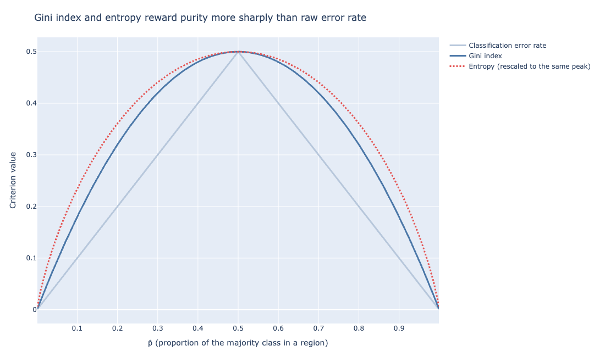
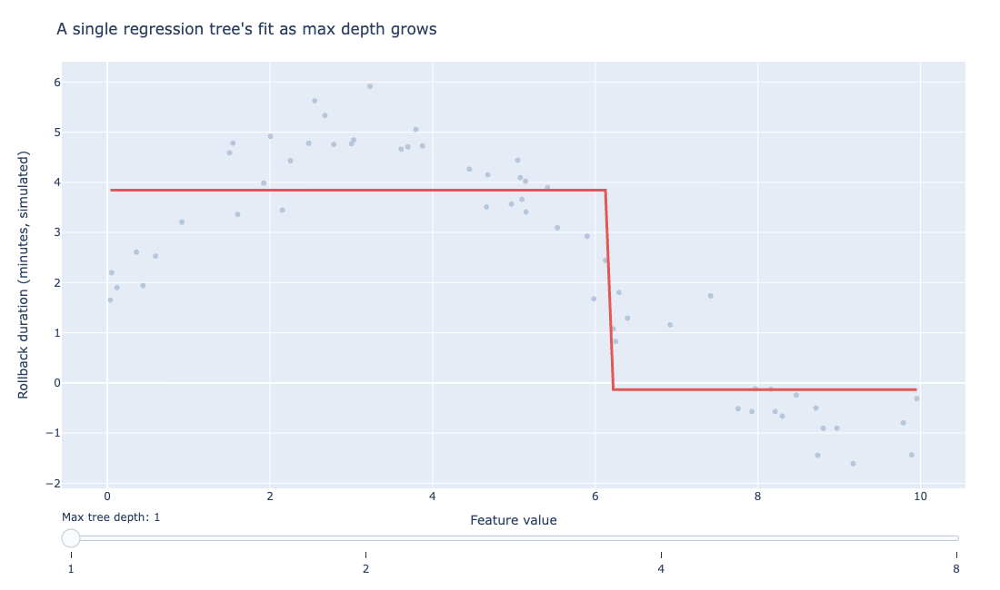
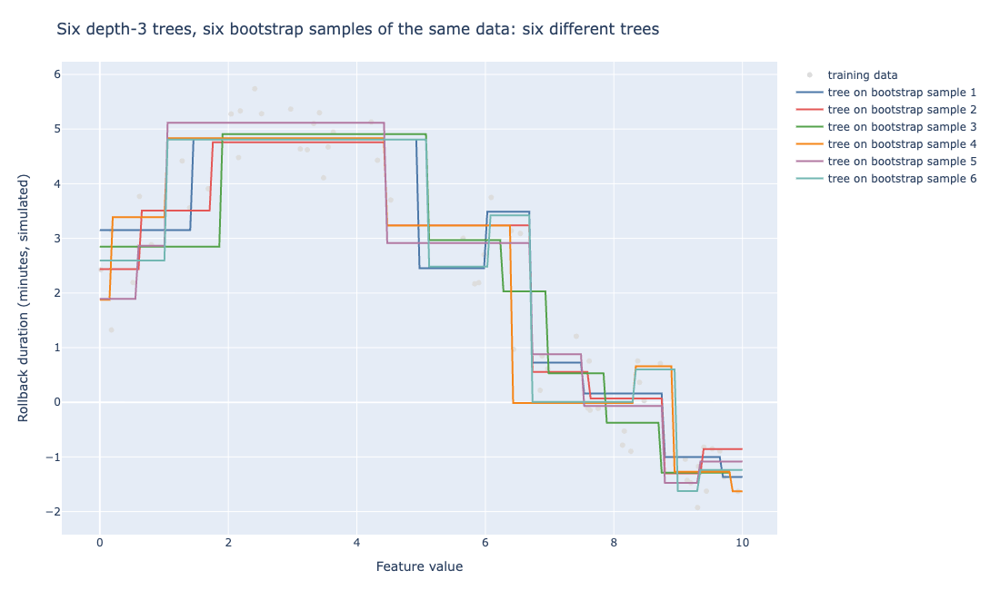
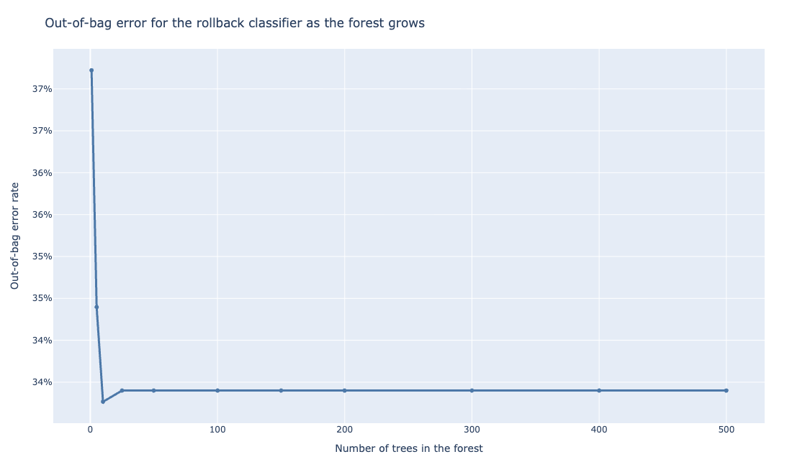
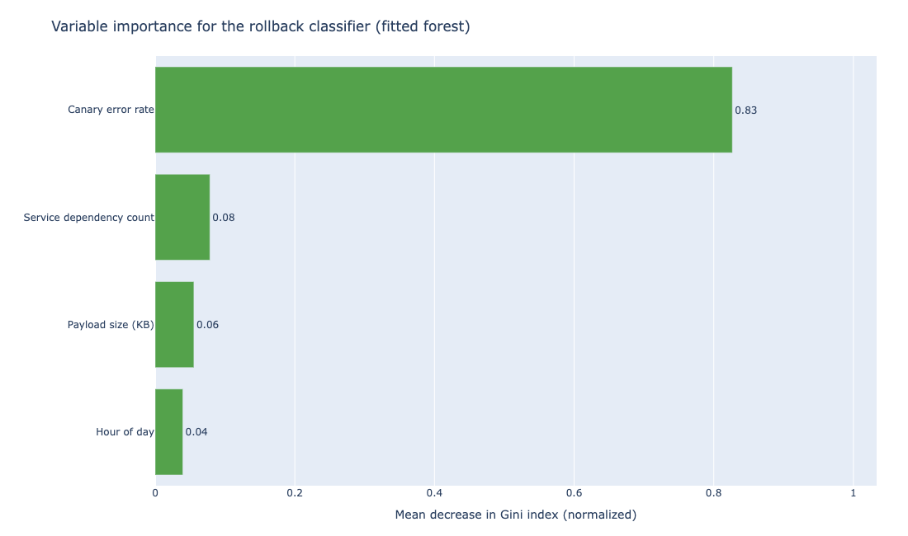
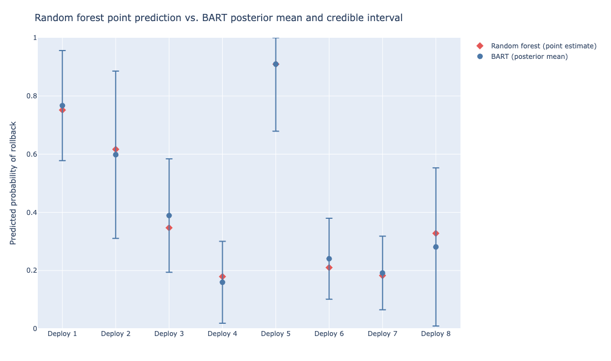

# Tree-Based Methods: Decision Trees and Random Forests

Suppose a platform team wants to automate a decision that an on-call engineer currently makes
by eye: after a canary deployment runs for five minutes, should it roll back automatically or
keep rolling out to the rest of the fleet?

The signals available are the payload size of the new build, the error rate observed in the
canary window, the hour of day, and the number of downstream services the deployment depends
on. A *decision tree* answers this kind of question by asking a sequence of yes-or-no
questions about the data, each one splitting the remaining cases into two groups, until it
reaches a final call.

## Regression trees and recursive binary splitting

Consider first a simpler version of the problem: predicting a continuous number, the rollback
duration in minutes, rather than a yes-or-no outcome. A *regression tree* builds its predictions
by *recursive binary splitting*: at each step, it searches every possible predictor and every
possible split point on that predictor. It then picks the single split that reduces the residual
sum of squares (RSS) the most.

Before the formula: imagine guessing a stranger's height with no clues, then guessing again
after learning their age group. The second guess lands closer more often. RSS tallies how far
off every guess is, squared so big misses count more. A split earns its place only if it
shrinks that tally by enough.

$$\text{RSS} = \sum_{j=1}^{2}\sum_{i \in R_j}(y_i - \bar{y}_{R_j})^2$$

In other words, once a split divides the data into two regions $R_1$ and $R_2$, each region's
prediction is simply the average outcome of the training cases that fall into it. The split
is scored by how much closer those regional averages get to the true values than a single
overall average would.

The algorithm repeats this greedily: split the whole dataset once, then split each resulting
region again, and so on, until a stopping rule (a minimum number of observations per region,
typically) halts further splitting.

Working a small version of this same idea concretely: suppose eight historical rollbacks have
durations of 2, 3, 3, 4, 9, 10, 11, and 12 minutes. A candidate split on canary error rate
above versus at or below 3% sorts the first four into one region and the last four into the
other.

Measured against the overall mean of 6.75 minutes, the unsplit RSS is 119.5. After the split,
region $R_1$'s mean is 3.0 and region $R_2$'s mean is 10.5, and RSS drops to 7.0. That drop
from 119.5 to 7.0 is the kind of signal recursive binary splitting looks for: the algorithm
searches every predictor and every threshold, then keeps whichever candidate split shrinks RSS
the most.

This is a *greedy* algorithm: at each step, it picks the best split available right then,
without looking ahead to see whether a different split now would enable a better split later.
That greediness is also what makes trees fast to fit, since the alternative, searching every
possible sequence of splits jointly, is computationally out of reach for anything but a tiny
dataset.

## Classification trees: Gini index, entropy, and error rate

The rollback decision itself is a yes-or-no outcome, which calls for a *classification tree*.
The mechanics are the same recursive binary splitting, but the criterion for scoring a split
changes, since RSS is not defined for a categorical outcome. Three criteria are used in
practice.

The simplest, the *classification error rate*, scores a region by the fraction of training
cases in it that do not belong to the majority class:

$$E = 1 - \max_k(\hat{p}_k)$$

where $\hat{p}_k$ is the proportion of cases in the region belonging to class $k$. In other
words, if 8 of 10 canary deployments in a region eventually needed a rollback, the error rate
is $1 - 0.8 = 0.2$.

The trouble with this criterion is that it is not sensitive enough: two different splits can
produce the same error rate while leaving one split's regions much more skewed toward one class
than the other. Skew is what a growing tree should reward, and the classification error rate
cannot see it.

Picture sorting mixed red and blue marbles into two bins. A bin that ends up all one color is
progress; a bin still near 50/50 means little was learned. The *Gini index* scores how mixed a
bin still is, so a tree can pick the split that unmixes it the most. It fixes the error rate's
blind spot by measuring total variance across all $K$ classes rather than just the majority
class:

$$G = \sum_{k=1}^{K}\hat{p}_k(1 - \hat{p}_k)$$

Roughly speaking, the Gini index is small when a region is close to pure (nearly all one class)
and large when a region is close to a 50/50 split. A split that produces two purer child
regions is rewarded, even if the plain error rate would not have distinguished it from a worse
split. *Entropy* (or cross-entropy) plays a similar role using a different formula:

$$D = -\sum_{k=1}^{K}\hat{p}_k \log \hat{p}_k$$

Like the Gini index, $D$ is small when a region is close to pure and larger when its classes
are more evenly mixed; it just reaches those values along a slightly different curve. In
practice, the Gini index and entropy produce nearly identical trees. Either is a better
splitting criterion than raw classification error, which is typically used only for pruning a
tree once it has been grown, not for growing it.

::: {.callout-tip}
Grow a classification tree with the Gini index or entropy, not the plain classification error
rate. Save the error rate for pruning, where its coarser scale is standard practice rather than
a liability.
:::

::: {#fig-split-criteria}


```{=html}
<iframe src="../_generated/chapter-trees-fig-split-criteria.html" width="100%" height="540"
        style="border:1px solid #ddd; border-radius:6px;" loading="lazy"></iframe>
```

Gini index and entropy (rescaled to the same peak) both curve above the classification error
rate's straight-line shape everywhere except at $\hat{p} = 0$, $0.5$, and $1$. That curve is
why they reward a split moving toward purity even before either region is fully sorted.
:::

@fig-split-criteria shows why: the classification error rate is piecewise linear in $\hat{p}$,
while Gini and entropy are both curved, penalizing a region that sits at $\hat{p} = 0.6$ or
$0.7$ more than a straight line would. Both criteria are convex functions of $\hat{p}$, which
rewards moving away from a 50/50 split even before a region becomes pure. That gradient is what
lets a growing tree tell two similarly impure splits apart.

Working the rollback example concretely: suppose the canary-error-rate feature splits 40
historical deployments into two groups at a 2% threshold. Among the 12 deployments with a
canary error rate above 2%, 10 needed a rollback and 2 did not ($\hat{p}_{\text{rollback}} =
0.833$); among the 28 deployments at or below 2%, 3 needed a rollback and 25 did not
($\hat{p}_{\text{rollback}} = 0.107$).

The Gini index for the first group is $2 \times 0.833 \times 0.167 \approx 0.278$, and for the
second group is $2 \times 0.107 \times 0.893 \approx 0.191$.

Both are well below the Gini index of the unsplit dataset, $2 \times 0.325 \times 0.675 \approx
0.439$ (13 of 40 deployments needed a rollback overall), which is the signal that tells the
algorithm this split is worth making.

## Trees, categorical predictors, and interactions

Before turning to overfitting, it is worth naming two things trees handle for free that
Chapter 4's linear and logistic regression models do not.

First, categorical predictors need no special treatment: a split on "deployment strategy is
blue-green" versus "deployment strategy is rolling" is as natural to a tree as a split on
canary error rate above or below 2%. A linear model, by contrast, would need that categorical
field converted into dummy variables before it could be used at all.

Second, trees discover interactions automatically. Suppose the rollback risk from a high
canary error rate is much worse specifically when the deployment also touches many downstream
services, and mild otherwise.

A linear model only captures that if someone manually adds an interaction term (error rate
times dependency count) to the formula. A tree finds it on its own: splitting first on
dependency count and then on error rate within each resulting branch is the kind of structure
recursive binary splitting is built to discover.

This does not make trees strictly better than linear models. Where the true relationship
between predictors and outcome is close to linear, as the payload-size-to-latency relationship
in Chapter 1 largely was, a linear model has the advantage. It fits the relationship with far
fewer parameters and far less variance than a tree needs to approximate the same line out of a
series of step functions.

Trees earn their keep specifically when the relationship is not additive and not linear, and
when categorical and numeric predictors need to interact in ways nobody wants to hand-specify
in advance.

## Tree depth, overfitting, and cost-complexity pruning

Nothing stops recursive binary splitting on its own; left unchecked, it keeps growing a tree
until its fit looks like the figure below.

::: {#fig-tree-overfitting}


```{=html}
<iframe src="../_generated/chapter-trees-fig-tree-overfitting.html" width="100%" height="540"
        style="border:1px solid #ddd; border-radius:6px;" loading="lazy"></iframe>
```

A single regression tree's fit as its max depth grows from a shallow stump to a deep,
memorizing tree. The best-generalizing depth sits between the two extremes, not at either end.
:::

@fig-tree-overfitting shows the same underlying pattern fit by trees of increasing depth. A
depth-1 tree barely captures the shape; a depth-8 tree chases every bump in the training noise.
The tree that would generalize best sits somewhere in between, which is the tree size
cost-complexity pruning is built to find.

Left to run to the end, recursive binary splitting continues until every region contains a
single training observation, at which point the tree has memorized the training data perfectly
and generalizes to nothing. A deep, fully grown tree is a high-variance model: change a handful
of training examples, and the sequence of splits, especially near the top of the tree, can
shift enough to produce a noticeably different final tree.

Think of a gardener who lets a hedge grow out fully, then trims back the branches that add mess
rather than shape. The standard fix is *cost-complexity pruning*, sometimes called weakest-link
pruning.

::: {.callout-tip}
Resist the urge to stop splitting early with a fixed depth or leaf-count rule. Growing the tree
out fully and pruning back with cross-validation almost always finds a better tree size than
guessing a stopping point in advance, since an early stop can cut off a split that would have
paid off further down.
:::

Rather than stopping the tree early using an ad hoc rule (which risks stopping just before a
split that would have paid off later), the standard approach grows the tree as large as
reasonably possible, then prunes it back.

Pruning selects a sequence of subtrees indexed by a complexity parameter $\alpha$ that penalizes
the number of terminal nodes (each terminal node, also called a leaf, is one of the regions like
$R_1$ and $R_2$ from the earlier regression-tree example).

Cross-validation (the previous chapter's subject) then picks the value of $\alpha$, and
therefore the tree size, that minimizes estimated test error.

## Why a single tree has high variance

Consider a rollback-prediction tree built on one quarter's worth of deployment data, and a
second tree built on the next quarter's data. Even if the underlying relationship between the
features and rollbacks has not changed, the two trees will often disagree on which feature to
split on first, and a disagreement near the root reshapes everything beneath it.

This instability is the central weakness of decision trees relative to nearly every other
method in this book: they are easy to interpret and visualize, but a single tree's predictions
do not hold steady the way a linear model's coefficients do when the training sample changes
modestly.

::: {.callout-warning}
Do not treat a single tree's chosen splits, especially the root split, as a settled finding
about which feature matters most. A different quarter of training data can move the whole
structure.
:::

::: {#fig-tree-instability}


```{=html}
<iframe src="../_generated/chapter-trees-fig-tree-instability.html" width="100%" height="540"
        style="border:1px solid #ddd; border-radius:6px;" loading="lazy"></iframe>
```

Six depth-3 trees fit on six bootstrap resamples of the same underlying data. Every tree sees
data drawn from the same distribution; no two trees agree on where to place their splits.
:::

@fig-tree-instability makes the claim concrete rather than asserted. Each colored line is a tree
of the same depth, fit on a random resample of the same 60 observations. The trees mostly agree
on the broad shape, but disagree by a full unit or more on where each step happens and how tall
it is, particularly in the busiest region of the data between $x = 0$ and $x = 2$.

Average enough of these disagreeing trees together, weighting each one equally, and the
individual disagreements cancel out far more than any one tree's error does, which is the
entire mechanism bagging exploits next.

## Bagging: bootstrap aggregation

This is the jellybean-jar trick: ask ten people to guess how many jellybeans are in a jar, and
the average of all ten guesses usually lands closer to the true count than most individual
guesses did, since the too-high and too-low guesses cancel out.

*Bagging*, short for bootstrap aggregation, addresses tree instability directly by exploiting
a basic statistical fact: averaging a set of noisy, high-variance estimates reduces variance,
since $\text{Var}(\bar{X}) = \sigma^2/n$ for $n$ independent estimates of the same quantity.

Bagging generates that set of estimates by drawing $B$ bootstrap samples from the training data
(each one a random sample of the same size, drawn with replacement) and fitting a full,
unpruned decision tree to each bootstrap sample. It then averages the $B$ trees' predictions
for regression, or takes a majority vote for classification.

For the rollback classifier, this means growing several hundred trees, each on a slightly
different resample of the historical deployment data, and predicting rollback if a majority of
those trees vote rollback. Individually, each tree still overfits its own bootstrap sample; the
averaging is what recovers a stable, low-variance prediction from a collection of unstable,
high-variance ones.

::: {.callout-tip}
Grow each tree in a bagged ensemble deep and unpruned, on purpose. Averaging across trees is
what controls overfitting here, not the pruning step a single tree relies on.
:::

## Random forests: decorrelating trees with random feature selection

Bagging alone has a limitation: if one feature (say, canary error rate) is by far the strongest
predictor, nearly every bootstrapped tree will choose it for the first split. That means the
$B$ trees end up highly correlated with each other.

Averaging correlated estimates reduces variance by much less than averaging independent ones
does, since correlation works directly against the $\sigma^2/n$ variance reduction bagging
relies on. Ten copies of the same guess average to that one guess no matter how many copies get
thrown in; only guesses that miss in different directions buy the variance reduction bagging is
built on.

A *random forest*, the method Leo Breiman formalized in 2001 [@breiman2001randomforests], fixes
this. At each split in each tree, it restricts the algorithm to choose only among a random
subset of $m$ predictors (typically $m \approx \sqrt{p}$ for classification, where $p$ is the
total number of predictors) rather than all of them.

This forces the trees to occasionally split on a weaker predictor, such as service dependency
count or hour of day, instead of always defaulting to canary error rate. That decorrelates the
trees and lets averaging do more of its variance-reduction work. Bagging is the special case of
a random forest where $m = p$; the term "random forest" specifically refers to the version with
$m < p$.

::: {.callout-tip}
Start with $m \approx \sqrt{p}$ and leave it there. Random forests are unusually forgiving to
tune, and hand-picking $m$ rarely beats the default by much.
:::

::: {#fig-oob-error}


```{=html}
<iframe src="../_generated/chapter-trees-fig-oob-error.html" width="100%" height="540"
        style="border:1px solid #ddd; border-radius:6px;" loading="lazy"></iframe>
```

Out-of-bag error for the rollback classifier falls sharply in the first handful of trees, then
flattens around 34% by roughly 25 trees. Adding trees past that point costs training time, not
accuracy.
:::

@fig-oob-error shows out-of-bag error (defined next) falling and then flattening as more trees
are added to the forest. Note that adding more trees past that flattening point does not
increase overfitting risk the way growing a single tree deeper does; it mainly costs training
time. Random forests are far more forgiving to tune than a single pruned tree.

## Out-of-bag error estimation

Each bootstrap sample used to grow a tree in the forest leaves out, on average, about a third
of the training observations (a property of sampling with replacement: the probability any
given observation is excluded from a bootstrap sample of the same size approaches $1/e \approx
0.368$ as the sample size grows). Those left-out observations are called *out-of-bag* (OOB) for
that particular tree.

Since the tree never saw them during training, predicting on them is a legitimate estimate of
test error, computed for free as a byproduct of fitting the forest rather than requiring a
held-out validation set or a cross-validation loop.

For the rollback forest, OOB error settles around 34% after a couple dozen trees. That number
comes for free, without touching a separate validation set.

A 1-in-3 error rate is not something to fully automate on its own. It is cheap enough to
recompute every time the model retrains, which makes it a useful early warning: a sudden jump
in OOB error after a retrain is a signal worth investigating before trusting the forest's
rollback calls again.

## Variable importance

A single decision tree is easy to read directly: trace the path from root to leaf. A forest of
several hundred trees is not, which is the trade-off random forests make for their
lower-variance predictions.

*Variable importance* recovers some of that lost interpretability. For each predictor, it
measures the total decrease in RSS (regression) or Gini index (classification) produced by
splits on that predictor, summed across every tree in the forest and averaged.

This measure is a rough ranking, not a precise decomposition of credit. A predictor with many
candidate split thresholds gets more chances to turn up a locally good split than one with few
distinct values, which can inflate its importance for reasons unrelated to how much it drives
the outcome.

Two correlated predictors, meanwhile, split the credit for the same signal between them, which
can make each one look weaker than either would look alone [@strobl2007bias].

::: {.callout-warning}
Variable importance is a guide to where the forest is finding structure, not a certified
attribution of cause. Treat a low score with suspicion if that predictor is correlated with a
high-scoring one.
:::

::: {#fig-variable-importance}


```{=html}
<iframe src="../_generated/chapter-trees-fig-variable-importance.html" width="100%" height="480"
        style="border:1px solid #ddd; border-radius:6px;" loading="lazy"></iframe>
```

Variable importance for the rollback classifier: canary error rate dominates, but the other
three features carry measurable signal too.
:::

@fig-variable-importance ranks the four rollback features by importance. Canary error rate
dominates, which matches intuition.

But service dependency count carries more signal than hour of day, a finding worth acting on: a
deployment touching many downstream services is meaningfully riskier at a given error rate than
a deployment with few dependencies. That is the kind of interaction a human reviewer skimming a
dashboard of raw error rates would likely miss.

## When to reach for a single tree, a forest, or boosting

Four different tree-based tools have appeared across this chapter, and it is worth being
explicit about when each earns its place, since defaulting to the fanciest available option is
its own kind of mistake.

A single pruned tree is the right choice when the audience for the model needs to see the
reasoning behind a prediction, not just trust a number. A compliance reviewer asking why a
particular deployment was auto-rolled-back wants an answer like "canary error rate exceeded 2%
and the deployment touched more than 6 downstream services," which only a small, interpretable
tree delivers directly. A 400-tree forest cannot be read that way at all.

A random forest is the right default for most production prediction problems where accuracy
matters more than a fully traceable explanation. It trains fast, tunes with almost no effort
(the number of trees and the number of features sampled per split are close to the only
knobs), and gives OOB error and variable importance essentially for free.

The rollback classifier in this chapter is a clear case of this kind of problem: nobody needs
to explain each individual prediction. They need the aggregate error rate low enough to trust
the automation.

Gradient boosting, the subject of the next chapter, usually edges out a random forest on raw
predictive accuracy on structured, tabular data like this one, at the cost of being more
sensitive to hyperparameter choices and slower to reason about informally. It fits trees
sequentially, each one correcting the errors of the ensemble built so far, rather than fitting
many independent trees in parallel the way bagging and random forests do.

BART is worth the added compute specifically when a wrong prediction is costly enough that the
team needs to know how much to trust each individual prediction, not just the aggregate error
rate. An automated rollback system with no human review is a much stronger candidate for BART's
credible intervals, the per-prediction uncertainty ranges the next section works through, than
a dashboard a human glances at before making the final call.

## A Bayesian perspective

Picture asking a group of cautious forecasters for a prediction, where no single one is allowed
to move the answer far from where the group started. Their small, careful adjustments add up to
both a final guess and a sense of how much the group agrees, which is what BART delivers below.

Random forests give a point prediction and, through OOB error, a rough sense of how often the
forest is wrong overall. *Bayesian Additive Regression Trees* (BART), introduced by Chipman,
George, and McCulloch, go further and treat the sum of trees itself as the object of Bayesian
inference rather than a black box averaged after the fact. That produces a full uncertainty
interval around each individual prediction [@chipman2010bart].

That interval tends to be well calibrated in practice, but calibration is not automatic: it
depends on the priors chosen for tree structure and leaf values and on the MCMC chain having
converged, the kind of check Chapter 9 introduces for diagnosing a model fit by MCMC.

BART builds its prediction as a sum of many trees, typically 100 to 200, but constrains every
individual tree to be a *weak learner* through the prior distribution placed on tree structure
and on the value predicted at each leaf. The prior favors shallow trees with small leaf
values, so no single tree is allowed to explain much of the outcome on its own; the trees only
become expressive in aggregate, through their sum.

This is a meaningfully different mechanism from a random forest's variance reduction through
averaging many strong, overfit trees. BART instead reduces variance by keeping every individual
tree weak from the start, then lets a Bayesian backfitting Markov chain Monte Carlo algorithm
sample from the posterior distribution over the entire sum of trees.

In other words, instead of settling on one best-fitting sum of trees, the algorithm keeps
track of many plausible sums of trees that all fit the training data reasonably well, each one
weighted by how well it fits.

That posterior is the payoff. Instead of one point prediction per deployment, BART returns a
distribution of predictions, one per MCMC sample, from which a full credible interval (the
Bayesian analog of a confidence interval) follows directly: not just "this deployment has an
82% chance of needing a rollback" but a defensible range around that 82%, reflecting how much
the training data supports it.

BART also gives a Bayesian analog to variable importance for free, since the posterior tracks
how often each predictor gets used for a split across the sampled trees. A predictor used
rarely across the posterior draws is one the data does not support leaning on.

::: {.callout-note}
A wide credible interval is information, not noise. It tells the team this specific prediction
needs a human look before acting on it, even when the point estimate looks confident.
:::

::: {#fig-bart-vs-rf}


```{=html}
<iframe src="../_generated/chapter-trees-fig-bart-vs-rf.html" width="100%" height="480"
        style="border:1px solid #ddd; border-radius:6px;" loading="lazy"></iframe>
```

A random forest's point predictions next to BART's posterior mean and credible interval for
the same eight deployments. BART's interval width is not constant: it flags which predictions
rest on thin evidence.
:::

@fig-bart-vs-rf lines the two models up on the same eight held-out deployments. The point
predictions mostly agree, but BART's credible intervals are not the same width from deployment
to deployment: the model is honest about which predictions rest on thin evidence and which ones
it can stand behind.

The trade-off is computational. Fitting a random forest of several hundred trees is fast and
trivially parallel across trees; fitting BART requires running an MCMC chain to convergence,
which is slower and does not parallelize the same way, since each MCMC iteration depends on
the last.

For the rollback classifier, a random forest retrained nightly on the latest deployment data
is a reasonable production choice. BART is worth reaching for when the cost of an
overconfident prediction, not just an incorrect one, is high enough to justify the extra
compute, for instance when the rollback decision feeds directly into an automated action with
no human in the loop.

## References {.unnumbered}

::: {#refs}
:::
