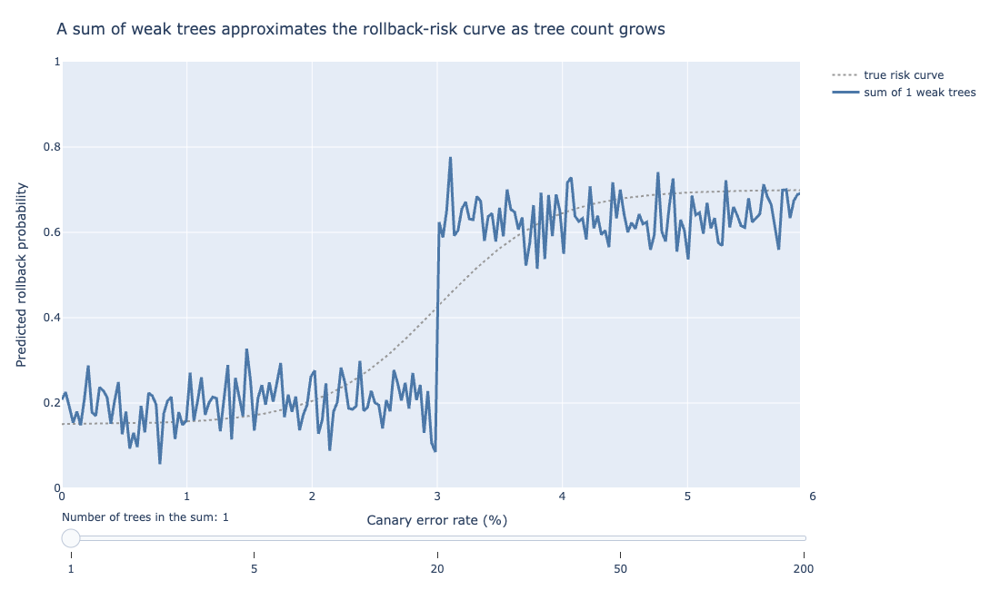
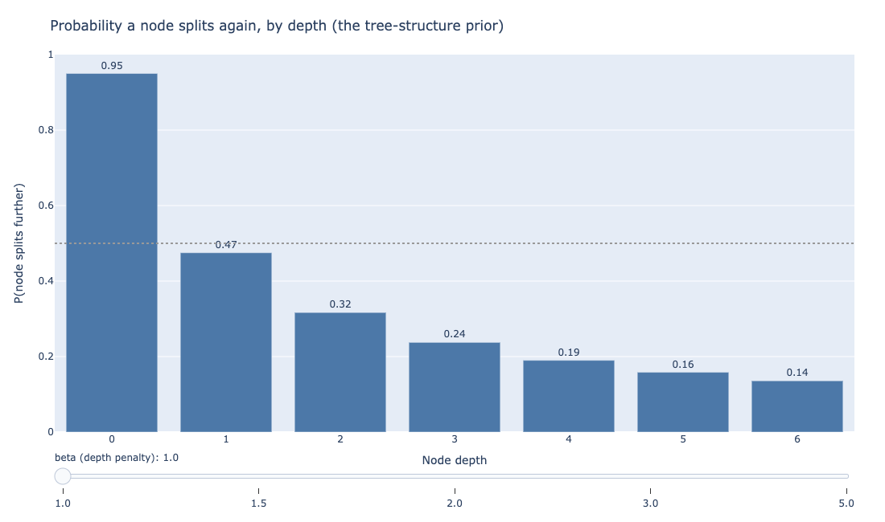
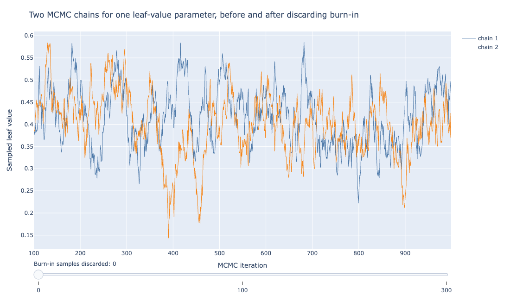
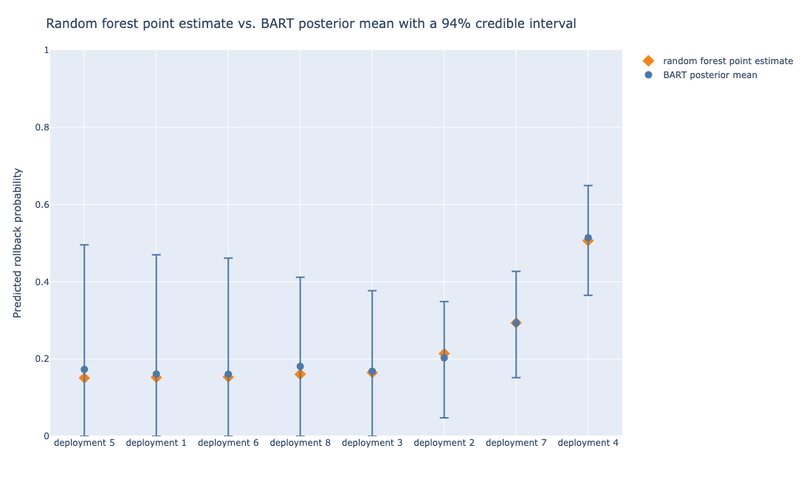
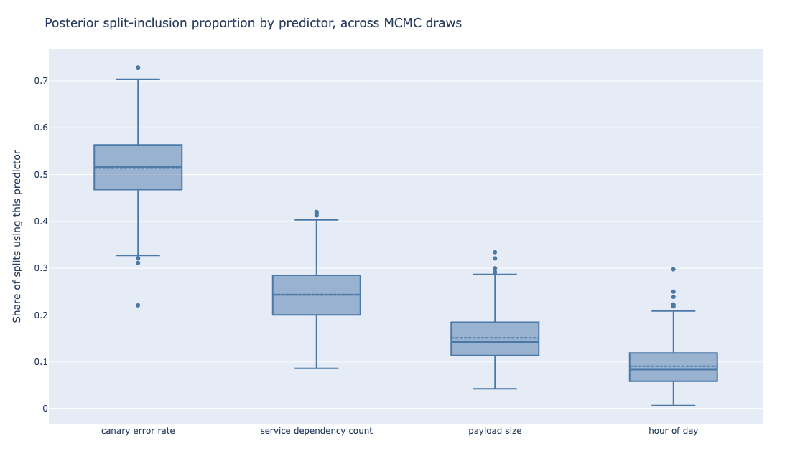

# Bayesian Additive Regression Trees (BART)

Suppose the rollback classifier from Chapter 7 stops being a dashboard a human glances at
before deciding, and becomes the decision itself: no human in the loop, a canary that scores
above some threshold gets rolled back automatically, every time, at 3 a.m. included. The random
forest built in that chapter can still produce the score.

What it cannot produce is an honest answer to a harder question: how much should anyone trust
that particular score, for this particular deployment, given how much training data resembled
this deployment. A forest of 400 trees converges on one number and stops talking.

*Bayesian Additive Regression Trees* (BART) is a sum-of-trees model built specifically to keep
talking: instead of one score, it returns a full posterior distribution over the score.

In other words, BART hands back a whole range of plausible scores for that deployment, each
weighted by how likely it is given what the model saw in training, rather than a single number
with no sense of how confident to be in it. That distribution is what makes an automated
rollback decision defensible rather than merely fast.

## A sum of weak trees, not a vote among strong ones

The chart below approximates a step-shaped rollback-risk curve with a growing sum of shallow
trees.

::: {#fig-ensemble-buildup}


```{=html}
<iframe src="../_generated/chapter-bayes-bart-fig-ensemble-buildup.html" width="100%" height="540"
        style="border:1px solid #ddd; border-radius:6px;" loading="lazy"></iframe>
```

The x-axis is canary error rate and the y-axis is predicted rollback probability; the dotted
line is the true risk curve. At one tree, the position shown here, the sum forms a single rough
step, about 0.2 below a 3% error rate and about 0.65 above it. That single split lands close to
the true curve's midpoint but misses its smooth rise. Dragging the slider toward two hundred
trees smooths that one step into a curve that tracks the true curve closely across the whole
range.
:::

Think of guessing a stranger's age from a crowd of eyewitnesses, each only allowed a small,
cautious adjustment to the group's running guess. No single witness can swing the estimate far.
BART works the same way: many small, deliberately weak trees add up their tiny nudges into one
confident answer.

Recall from Chapter 7 that a random forest reduces variance by averaging many strong, deep,
individually overfit trees, decorrelated by restricting each split to a random subset of
predictors.

BART reduces variance through a different mechanism entirely: it keeps every individual tree
weak by construction, then sums many of them, typically 50 to 200, rather than averaging.

The distinction matters because it changes what a single tree in the ensemble is allowed to do.
A random forest's individual trees are grown deep and are expected to overfit; averaging is what
cleans that up afterward.

BART's individual trees are never allowed to overfit in the first place, because the *prior* on
tree structure penalizes deep splits and the *prior* on each leaf's predicted value keeps that
value small.

No single tree in a BART ensemble explains much of the outcome on its own. The trees only become
expressive collectively, the same way a Fourier series approximates a complicated function by
summing many simple sine waves, each contributing a small correction the others could not
supply.

@fig-ensemble-buildup shows this directly, with each tree contributing a small, controlled
adjustment rather than any one tree attempting to capture the whole shape.

:::{.callout-tip}
When a BART fit looks underpowered, resist the urge to deepen individual trees. Add more trees
to the sum instead; depth is capped by design, and the ensemble's expressiveness is meant to
come from the count of weak trees, not the strength of any one of them.
:::

## The three priors doing the work

The chart below plots the split probability by depth for the first of the three, the
tree-structure prior.

::: {#fig-tree-structure-prior}


```{=html}
<iframe src="../_generated/chapter-bayes-bart-fig-tree-structure-prior.html" width="100%"
        height="480" style="border:1px solid #ddd; border-radius:6px;" loading="lazy"></iframe>
```

The x-axis is node depth and the y-axis is the probability a node at that depth splits again. At
the slider's starting value of beta=1 shown here, that probability drops fast between depth 0
and depth 2, then flattens into a long, slow tail through depth 6. Dragging beta higher pushes
the whole curve down and makes it flatten out sooner.
:::

Think of three rules a strict teacher sets before grading: don't dig too deep into any one
topic, don't let any single answer swing the grade too much, and expect some natural randomness
in every score. BART's three priors play those same roles for its trees.

Three prior distributions carry BART's entire regularization burden, with no depth limit or
hand-chosen pruning rule doing separate work.

The *tree-structure prior* favors shallow trees. Formally, the probability that a given node
splits further decays as the node gets deeper in the tree, so most trees in the ensemble stay
two or three levels deep. This is the prior that keeps any single tree from carving out a
narrow, high-variance region of the feature space and memorizing it.

@fig-tree-structure-prior plots that split probability at the slider's starting penalty of
beta=1: a root node splits with near certainty (0.95), and by depth 3 that probability has
fallen under one-in-four.

Drag the slider toward beta=2, the value BART's default hyperparameters use later in this
section, and the same depth-3 probability drops under one-in-ten instead.

The *leaf-value prior* is a Normal distribution centered at zero with a small variance, placed
on the value each leaf predicts. Because that variance is small, no leaf is allowed to swing
far from zero on its own; a leaf's contribution to the final prediction is meant to be a small
nudge, not a decisive vote.

The variance is chosen so that, roughly, the sum of all the trees' contributions covers the
plausible range of the outcome. That is why adding more trees to the ensemble (each contributing
a smaller expected nudge) does not blow up the total prediction the way adding more
unconstrained trees would.

The *error-variance prior* governs how much unexplained noise the model expects in the outcome
itself, playing the same role a residual-variance term plays in ordinary regression. It
lets the model calibrate how tightly its posterior predictive interval should hug the fitted
curve.

Together, these three priors are the entire regularization mechanism. There is no separate
cost-complexity pruning step, no cross-validated depth parameter to select the way Chapter 7's
single decision tree needed one. The priors do that job continuously, as part of fitting the
model rather than after it.

Chipman, George, and McCulloch's original paper settled on default values for four
hyperparameters: the tree-depth penalty ($\alpha$ and $\beta$), the leaf-value prior scale
($k$), and the number of trees ($m$). Most implementations, `pymc-bart` included, still match
the paper's defaults for the first three.

A tree-depth penalty of $\alpha = 0.95$ and $\beta = 2$ sets how sharply the probability of a
further split decays with depth, and a leaf-value prior scaled by $k = 2$ ensures the sum of all
leaf contributions covers the observed range of the outcome with high prior probability, without
needing the modeler to compute that scale by hand [@chipman2010bart].

The fourth, the number of trees $m$, is where `pymc-bart` departs from the original paper:
Chipman, George, and McCulloch recommended $m = 200$, but `pymc-bart`'s own library default is
50 trees. That gap is part of why the code example below sets `m=100` explicitly rather than
leaving it at the default.

::: {.callout-note}
Check `pymc-bart`'s installed default for `m` before trusting an unmodified fit: at 50 trees it
sits well below the 200 the original BART paper recommended, and the code in this chapter sets
`m=100` deliberately rather than relying on that default.
:::

These defaults are why fitting a first BART model rarely requires much tuning on the priors
that matter most. Unlike a random forest's `max_depth` or a gradient-boosted model's learning
rate, both of which usually need deliberate search to get right, tuning `pymc-bart` rarely needs
more than a glance at the tree count to land on a reasonable starting point.

That holds on most tabular problems, including the rollback classifier here.

Raising $k$ makes the model more conservative: each leaf is pulled harder toward zero, so the
fit is smoother and the credible intervals wider. Lowering it lets individual trees make bigger
claims, at the cost of a fit that can look overconfident when the data does not support the
claim.

## How BART is fit: Bayesian backfitting

The chart below simulates two independently started MCMC chains for a single leaf-value
parameter.

::: {#fig-mcmc-trace}


```{=html}
<iframe src="../_generated/chapter-bayes-bart-fig-mcmc-trace.html" width="100%" height="480"
        style="border:1px solid #ddd; border-radius:6px;" loading="lazy"></iframe>
```

The x-axis is MCMC iteration and the y-axis is the sampled value of one leaf-value parameter.
Chain 1 (blue) and chain 2 (orange) trace out somewhat independent peaks and dips through the
first few hundred iterations, then increasingly move step for step with each other later in the
run, both staying inside roughly the same 0.15-to-0.6 band throughout. Drag the slider to
discard the early iterations and keep only the well-mixed tail, the pattern a converged
parameter is supposed to show.
:::

Think of a group project where each teammate revises their section based only on what's left
after subtracting everyone else's current work. Each round, every teammate updates in turn,
building on the others' latest draft. Bayesian backfitting fits BART's trees the same way, one
tree at a time.

A sum of 100 trees, each with its own structure and leaf values, is not a model with a
closed-form posterior: there is no formula that converts the priors and the data directly into
the posterior distribution, the way simpler Bayesian models allow.

BART is fit by an MCMC (Markov chain Monte Carlo) algorithm called *Bayesian backfitting*, and
the idea behind it connects directly to two things covered earlier in this book: gradient
boosting's residual-fitting logic (Chapter 8) and a Gibbs sampler's one-variable-at-a-time
updating logic.

At each MCMC iteration, Bayesian backfitting cycles through the trees one at a time. For a
given tree, it computes the *partial residual*: the outcome, minus the current predictions from
every other tree in the sum. That partial residual is what the tree being updated is asked to
explain.

A new tree structure and new leaf values are proposed (grown, pruned, or changed at a node) and
accepted or rejected according to how well they fit that partial residual, weighed against the
tree-structure and leaf-value priors from the previous section.

Once every tree has been updated this way, the algorithm has produced one full posterior sample
of the entire sum-of-trees model, and the cycle repeats.

This is structurally similar to how gradient boosting fits each new tree to the residual left
by the trees fit so far, with two differences that matter. First, gradient boosting fits each
tree once, greedily, and moves on, while Bayesian backfitting revisits every tree at every
iteration, proposing changes and sometimes rejecting them.

Second, gradient boosting searches for a single best ensemble, while Bayesian backfitting
samples from a posterior distribution over the whole ensemble instead.

Running this for several thousand iterations, after discarding an initial burn-in period where
the chain has not yet settled into the posterior's typical region, produces a set of posterior
samples: complete sum-of-trees models, each one a plausible explanation of the training data
under the prior.

@fig-mcmc-trace shows what a convergence check looks like for one parameter deep inside the
model: two independently started chains, wandering during burn-in, then settling into
overlapping variation around the same value.

A full BART fit checks this kind of diagnostic (typically via the R-hat statistic, which
compares between-chain and within-chain variance) across many parameters before trusting the
posterior samples.

::: {.callout-tip}
Check R-hat across every parameter in the ensemble, not only the one leaf-value trace this
chapter walks through by hand. One well-behaved trace does not guarantee the rest of the
sum-of-trees model has converged.
:::

## The rollback classifier in pymc-bart

The chart below compares BART's posterior mean and 94% credible interval against the random
forest's point estimate, for eight held-out deployments spanning a range of canary error rates.

::: {#fig-bart-vs-rf-interval}


```{=html}
<iframe src="../_generated/chapter-bayes-bart-fig-bart-vs-rf-interval.html" width="100%" height="520"
        style="border:1px solid #ddd; border-radius:6px;" loading="lazy"></iframe>
```

The x-axis lists eight held-out deployments, sorted by BART's posterior mean; the y-axis is
predicted rollback probability. Random forest point estimates (orange diamonds) and BART
posterior means (blue circles) sit close together at every deployment. Credible-interval width
varies more than the point estimates do: the five lowest-probability deployments carry
intervals reaching from 0 up to roughly 0.4-0.5, wider in absolute terms than deployment 4's
interval, the deployment with the highest predicted risk.
:::

`pymc-bart` is the actively maintained extension to PyMC that adds a `BART` distribution usable
inside an ordinary PyMC model, which is the standard way to fit BART in Python today. Fitting
the canary-rollback classifier from Chapter 7 with it looks like this:

```python
import pymc as pm
import pymc_bart as pmb

with pm.Model() as rollback_model:
    mu = pmb.BART("mu", X=X_train, Y=y_train, m=100)
    p = pm.Deterministic("p", pm.math.sigmoid(mu))
    rollback = pm.Bernoulli("rollback", p=p, observed=y_train)
    idata = pm.sample(2000, tune=1000, chains=4)
```

`X_train` here is the same four-column feature matrix Chapter 7 used (canary error rate, payload
size, hour of day, service dependency count). `m=100` sets the number of trees in the sum; the
PyMC-BART documentation reports good results in the 50-to-200 range for problems like this
one, with fewer trees useful mainly for faster iteration while developing the model.

Once `idata` holds the posterior samples, `pm.sample_posterior_predictive()` produces a
posterior predictive distribution for any new deployment, from which a credible interval
follows directly by taking percentiles across the posterior draws.

`arviz`, paired with PyMC throughout this book's Bayesian chapters, is the standard tool for
checking convergence diagnostics on the result before trusting it. @fig-bart-vs-rf-interval
compares that posterior against the random forest's point estimate for eight held-out
deployments.

:::{.callout-note}
Run the R-hat and effective-sample-size checks through `arviz` before reading any credible
interval off a BART fit. A wide interval from a chain that has not converged reflects unfinished
sampling, not model uncertainty, so treat it as a signal to run more iterations rather than as a
trustworthy confidence statement.
:::

The two models' point predictions are close, which is reassuring on its own: BART agrees with
the random forest on the answer and attaches a stated margin of doubt to it. What the random
forest's single number cannot show is that the interval width differs from deployment to
deployment.

Interval width here does not simply scale with the point estimate. The five lowest-probability
deployments in this set carry the widest credible intervals, several reaching down to 0, while
deployment 4, the one both models score as riskiest, gets the tightest interval of the eight.

That is the model being honest about which predictions rest on thin evidence in this particular
held-out set, the property a fully automated rollback decision needs and a bare point estimate
cannot supply.

## Variable importance from the posterior

The chart below shows the same four rollback features Chapter 7 ranked, but as a distribution
across MCMC draws rather than a single number per feature.

::: {#fig-variable-importance}


```{=html}
<iframe src="../_generated/chapter-bayes-bart-fig-variable-importance.html" width="100%" height="480"
        style="border:1px solid #ddd; border-radius:6px;" loading="lazy"></iframe>
```

The x-axis lists the four predictors and the y-axis is the share of MCMC-sampled splits that use
each one. Canary error rate's whole box sits above roughly 0.45, dominating by a wide margin and
matching the random forest's Gini-based ranking from Chapter 7. The remaining three predictors
show overlapping ranges rather than one clean ranking, which the single-bar Gini chart in
Chapter 7 could not show.
:::

Chapter 7's random forest measured variable importance by the total decrease in the Gini index
attributable to each predictor, summed across every tree.

BART's analog uses the posterior directly: `pymc-bart` provides `pmb.plot_variable_importance`,
which counts how often each predictor gets chosen for a split, across every tree and every
posterior draw, and reports the proportion.

A predictor that rarely gets split on, across thousands of posterior samples, is one the data
does not support leaning on. A slower but more thorough alternative built into the same
library, `method="backward"`, measures importance by how much predictive performance drops when
a variable is removed and the model is refit, one variable at a time.

@fig-variable-importance shows canary error rate dominating in both chapters' analyses, which is
a useful cross-check. Two different importance mechanisms, a Gini-based one and a
posterior-split-count one, agree on the ranking, which is stronger evidence that the ranking
reflects something in the data rather than an artifact of either method.

The box plots here also show something the random forest's single bar chart cannot: how much
the posterior itself disagrees, draw to draw, about how important service dependency count is
relative to payload size.

That disagreement is smaller than the uncertainty around any individual prediction, but it does
not disappear.

:::{.callout-tip}
When two predictors' importance boxes overlap this much, treat their relative order as unsettled
rather than reading a ranking off the median line alone. Refit with `method="backward"` if the
distinction matters for a downstream decision.
:::

## What this costs, and what it is worth

Fitting a random forest of several hundred trees takes seconds and parallelizes trivially,
since every tree is independent of every other tree. Fitting BART means running an MCMC chain
to convergence, which is slower by roughly one to two orders of magnitude for a dataset this
size.

::: {.callout-warning}
BART does not parallelize within a single chain the way a random forest's independent trees do,
since each MCMC iteration's proposal depends on the state left by the previous one. Running
multiple independent chains still leaves a fit one to two orders of magnitude slower than a
random forest's near-instant fit.
:::

Running multiple independent chains (as the code above does, with `chains=4`) does parallelize,
and is also how convergence gets checked, but it does not close the gap with a random forest's
near-instant fit.

BART also does not scale to the same dataset sizes or feature counts as easily. The
canary-rollback problem, with a few hundred to a few thousand historical deployments and four
features, sits comfortably within BART's practical range.

A dataset with millions of rows or hundreds of features pushes MCMC sampling time high enough
that a random forest or gradient boosting (Chapter 8) becomes the only practical option, full
posterior or not.

For readers coming from R, where most of the original BART tooling was built, the `dbarts` and
`BART` packages predate `pymc-bart` by years and remain the reference implementations much of
the applied literature on BART was written against.

`pymc-bart`'s advantage for a Python-first team is that it composes directly with the rest of a
PyMC model, the same way the logistic regression chapter's Bayesian section used PyMC directly.

The trade-off is not a verdict against BART, only a scope for when to reach for it. A dashboard
a human reviews before acting, where a point estimate plus a rough sense of the model's overall
error rate is enough context for a person to apply judgment, does not need BART's added compute.

An automated rollback system making the call alone, at any hour, with no person in the loop to
catch an overconfident wrong answer, is the situation where knowing how much to trust each
individual prediction is worth the extra time it takes to get that answer.

## The credible interval as a decision rule

A random forest's OOB error gives one number for how often the whole system is wrong; it says
nothing about which individual predictions to distrust.

BART's per-deployment credible interval can be turned into a routing rule directly: automate the
rollback decision only when the interval is narrow enough to trust unattended, and fall back to
paging an on-call engineer when it is not.

Concretely, a team could set a width threshold on the 94% credible interval, say 0.15 on the
probability scale, and split deployments into two paths. A deployment whose interval falls
inside that width gets the automated rollback decision the posterior mean supports.

A deployment whose interval is wider than that gets routed to a human instead of an automated
guess the model itself is not confident in.

That wider interval typically means the deployment's feature combination sits outside the dense
region of historical training data, such as an unusually large payload arriving at an unusual
hour with an unusually high dependency count all at once.

:::{.callout-important}
Set the credible-interval width threshold before looking at how any specific deployment scores,
not after. Picking a threshold to match a preferred outcome turns a statistical safeguard into a
rubber stamp.
:::

This is not something a random forest's point estimate can support without a separate, ad hoc
mechanism for estimating per-prediction confidence. BART's posterior gives it for free: the
interval width is part of what the model computes for every prediction, with no separate step
required.

## References {.unnumbered}

::: {#refs}
:::
