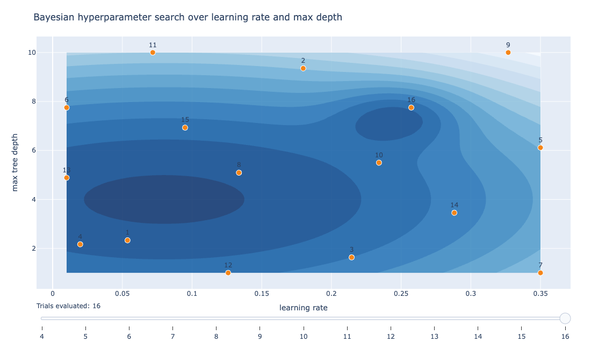
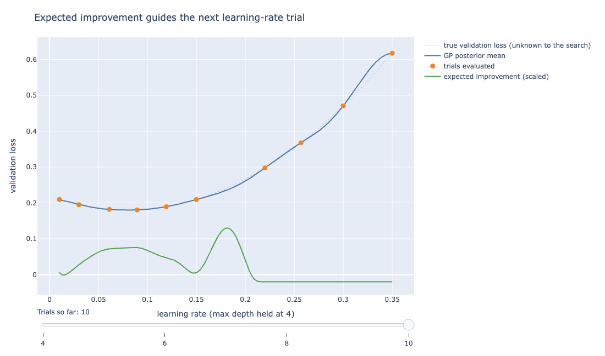
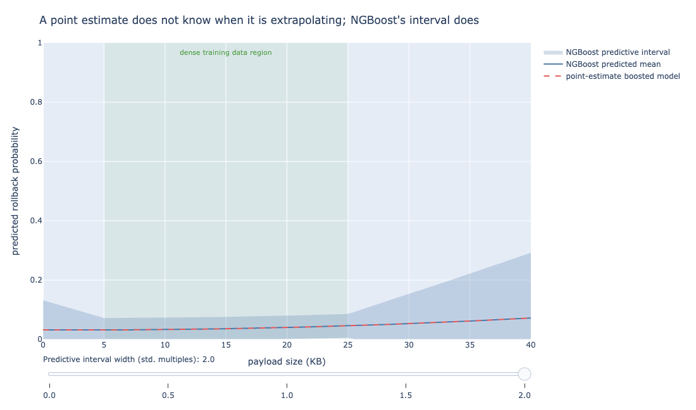

# Bayesian Approaches to Gradient Boosting

Chapter 9 turned a regression coefficient into a posterior distribution with a single choice
of prior. Chapter 12 turned a random forest into BART by putting a regularizing prior on tree
structure and leaf values, then sampling the ensemble with MCMC.

Gradient boosting resists the same move. It is worth being specific about why, before looking
at what a Bayesian practitioner does instead.

## Why boosting does not have a clean posterior

A Bayesian model update, in every case this book has covered, works by combining a prior belief
with a likelihood to get a posterior belief, then sampling from or computing that posterior
directly.

Conjugate linear regression does this in closed form: one formula, plugged in once, with no
iteration and no sampling required. Bayesian logistic regression and BART do it with MCMC
(Markov chain Monte Carlo), drawing samples that, in the long run, represent the posterior even
when no formula for it exists.

Both routes have the same shape: a well-defined target distribution exists, and the machinery's
job is to characterize it.

Gradient boosting, as Chapter 8 built it, does not define a target distribution at all. Recall
the mechanism: start from a constant prediction, compute the negative gradient of the loss with
respect to the current predictions, fit a small tree to that gradient, add it to the running
total with a learning rate applied, and repeat [@friedman2001].

Every step is a deterministic optimization move, a greedy step toward lower training loss, not
a draw from any distribution. There is no prior on "what the ensemble should look like" doing
any work in that loop, and no posterior falls out of it when the loop finishes.

XGBoost's regularization term penalizes leaf weights and leaf count [@chen2016xgboost], which
looks Bayesian in spirit. A penalty term is, after all, mathematically equivalent to a prior's
effect on a point estimate, the same equivalence Chapter 9 showed for Ridge and the Bayesian
Lasso.

But the equivalence stops there: nothing in XGBoost's fitting procedure ever samples, so the
output is a single fitted ensemble, a point estimate rather than a distribution over ensembles.

::: {.callout-note}
The core distinction: boosting optimizes greedily toward one fitted ensemble. It never defines
a target distribution to sample from, which is why it has no natural posterior the way linear
regression or trees do.
:::

This is not a minor implementation gap that a future release will close. It is a structural
property of what boosting optimizes: a single, sequentially-constructed function, chosen
greedily at each step to reduce loss the fastest. Nothing in the loop can represent more than
one plausible ensemble at a time.

Two practical threads exist despite this, and they solve different problems. Bayesian
hyperparameter optimization treats the *tuning* of a boosted model as a Bayesian decision
problem, leaving the model itself untouched.

NGBoost, covered later in this chapter, changes what the model predicts (a full distribution
instead of a point value) without changing how the ensemble is built. Neither one gives
gradient boosting the kind of posterior BART has over its ensemble.

## Bayesian hyperparameter optimization

Think of tuning a recipe's oven temperature and bake time. Instead of testing combinations at
random, a good cook uses what worked or flopped in earlier batches to guess where to try next.
That is Bayesian hyperparameter search in one sentence.

Suppose the rollback-risk model from Chapter 8 needs its learning rate and max tree depth
tuned. A grid search would try every combination on a fixed grid. A random search would sample
combinations uniformly.

Both treat every untried combination as equally worth trying next. That wastes evaluations on
combinations a reasonable person would expect to be bad, given what earlier trials revealed.

A Bayesian approach treats the relationship between hyperparameters and validation loss as an
unknown function to be modeled, the same framing Chapter 11 introduced for a different problem
(interpolating a noisy curve).

Here, the function being modeled is
$f(\text{learning rate}, \text{max depth}) = \text{validation loss}$, known only at the handful
of points evaluated so far.

In other words, plug in a learning rate and a max depth and this function would return how well
a model trained with those settings performs on held-out data, if only it could be written down
directly.

It cannot: the only way to learn its value at a given point is to train a model there and
measure the result, which is what makes every trial expensive.

A Gaussian process fits a posterior belief over that function from the trials run so far.
Recall from Chapter 11 that this means assigning a posterior belief not to a single number but
to every curve consistent with the points observed so far, weighted by how well each curve
fits.

As covered further down, a different kind of surrogate model can play the same role. An
*acquisition function* then scores every untried combination by how promising it is to try
next, balancing two things: how low the surrogate's mean prediction is there (exploitation) and
how uncertain the surrogate still is there (exploration).

*Expected improvement* (EI), the most common acquisition function, computes the expected amount
by which a new trial would beat the best result seen so far, under the surrogate's current
posterior.

::: {#fig-bo-search-trajectory}


```{=html}
<iframe src="../_generated/chapter-bayes-boosting-fig-search-trajectory.html" width="100%"
        height="580" style="border:1px solid #ddd; border-radius:6px;" loading="lazy"></iframe>
```

A Bayesian search's trials on a simulated validation-loss surface, learning rate vs. max depth.
Early trials spread out to explore; later trials cluster around the region that turns out to be
promising. Move the slider.
:::

@fig-bo-search-trajectory shows this loop run on a simulated validation-loss surface over
learning rate and max depth for the rollback-risk model, seeded with four random trials and
then extended one trial at a time by maximizing expected improvement. Move the slider forward
and watch where each new point lands.

Early trials spread out, since with almost nothing observed yet the surrogate's uncertainty
dominates the expected-improvement score everywhere. As more trials accumulate, later points
cluster around the region that turns out to be promising.

Occasionally the search still probes a far corner of the space where uncertainty remains high,
even though the mean prediction there looks unremarkable. That occasional probe is expected
improvement doing its job.

A point with mediocre predicted loss but wide uncertainty can still beat a point with slightly
better predicted loss and near-zero uncertainty, because the first point might turn out to be
excellent. The second point, by contrast, is unlikely to turn out much better than the best
trial found so far.

::: {#fig-expected-improvement}


```{=html}
<iframe src="../_generated/chapter-bayes-boosting-fig-expected-improvement.html" width="100%"
        height="560" style="border:1px solid #ddd; border-radius:6px;" loading="lazy"></iframe>
```

The GP posterior mean, the trials evaluated, and the expected-improvement curve that picks the
next trial. EI peaks not at the best point seen so far but where promise and uncertainty
overlap. Move the slider.
:::

@fig-expected-improvement isolates one hyperparameter (learning rate, with max depth held
fixed) and shows the GP surrogate's posterior mean, the true underlying loss curve (which the
search never sees directly), the trials evaluated so far, and the expected-improvement curve
that decides where the next trial lands.

Note where expected improvement peaks relative to the trials evaluated so far. It is not
highest at the best point found so far, since that point's uncertainty has shrunk from being
explored.

It is not highest in the region furthest from any trial either, since that area is uncertain
but the surrogate's mean prediction offers no reason to expect it is good. Instead, it peaks
somewhere the surrogate is both moderately optimistic and still uncertain enough to be worth
checking.

In practice, nobody hand-writes this loop. `Optuna`, the most actively maintained and widely
adopted Bayesian hyperparameter optimization library in Python today, defaults to a
tree-structured Parzen estimator (TPE) rather than a Gaussian process as its surrogate model
[@akiba2019optuna].

A TPE models the *distribution of hyperparameters* that produced good versus bad results,
rather than modeling the loss surface directly the way a GP does. It scales better to many
hyperparameters and to non-numeric (categorical) ones, at the cost of a less interpretable
surrogate than a GP's.

`scikit-optimize` (`skopt`) offers a more traditional GP-based Bayesian optimizer, closer to
what @fig-bo-search-trajectory demonstrates directly.

For problems where the objective function is expensive enough that every evaluation counts (a
model that takes hours to train, not milliseconds), `BoTorch` is the name worth knowing for
GP-based Bayesian optimization at a larger scale, built on PyTorch and commonly used for tuning
deep learning training runs rather than gradient-boosted trees.

::: {.callout-note}
Tooling changes fast in this space. `scikit-optimize`'s maintainers archived the repository in
2024, and `GPyOpt` has seen little active maintenance in recent years. Check a library's
commit history before depending on it for new work.
:::

A worked call against the rollback-risk model, in Optuna's own idiom:

```python
import optuna
from sklearn.ensemble import GradientBoostingClassifier
from sklearn.model_selection import cross_val_score

def objective(trial):
    lr = trial.suggest_float("learning_rate", 0.01, 0.35, log=True)
    depth = trial.suggest_int("max_depth", 1, 10)
    model = GradientBoostingClassifier(learning_rate=lr, max_depth=depth, n_estimators=200)
    score = cross_val_score(model, X_train, y_train, cv=5, scoring="neg_log_loss")
    return -score.mean()

study = optuna.create_study(direction="minimize")
study.optimize(objective, n_trials=30)
print(study.best_params)
```

Thirty trials with this search routinely land close to the region a much larger grid search
would have found. Every trial after the first handful is chosen using what the earlier trials
revealed, the same logic @fig-bo-search-trajectory shows visually.

## NGBoost: a boosted model that outputs a distribution

Picture two weather forecasters. One says "72 degrees tomorrow" and stops there. The other says
"72 degrees, but anywhere from 65 to 79 wouldn't surprise me." NGBoost is built to be the
second kind of forecaster.

A separate, more direct answer to "how do I get uncertainty out of a boosted model" is to
change what the model predicts, not how it is tuned. `NGBoost` (Natural Gradient Boosting) fits
a boosted ensemble the usual way, one tree at a time correcting the ensemble's current
mistakes.

But instead of predicting a single number, it predicts the parameters of a full probability
distribution [@duan2020ngboost]. For a continuous target, that typically means a Normal
distribution's mean and variance.

For a rollback-probability target, it means a Bernoulli parameter (the probability that a given
deployment triggers a rollback) trained against a proper scoring rule, a loss function whose
minimum is reached only when the predicted probability matches the true probability, so the
model has no incentive to hedge toward 50% or overstate its confidence.

That training target keeps the probability calibrated, though a single Bernoulli parameter
carries no separate variance term the way the continuous case does.

The "natural" in the name refers to natural gradient descent, a technique for taking
optimization steps that account for the geometry of the distribution's parameter space rather
than treating every parameter as an independent, equally-scaled coordinate.

That geometry-aware approach turns out to matter a great deal for training stability when the
thing being predicted is a distribution's parameters rather than a single value.

::: {#fig-ngboost-width}


```{=html}
<iframe src="../_generated/chapter-bayes-boosting-fig-ngboost-width.html" width="100%"
        height="560" style="border:1px solid #ddd; border-radius:6px;" loading="lazy"></iframe>
```

NGBoost's predicted mean (solid blue) tracks the point-estimate model's forecast (dashed red)
closely at every payload size on the x-axis, but only NGBoost adds a shaded interval around it.
That interval stays narrow inside the dense training-data region (roughly 5 to 25 KB) and
widens sharply for payload sizes below and above it, since fewer training examples there leave
the model less certain about the predicted rollback probability. Move the slider.
:::

@fig-ngboost-width contrasts a point-estimate boosted model's prediction with an NGBoost-style
predictive interval, on payload size ranging outside the region where training data was dense.

The point-estimate model's dashed line has no opinion about where it is extrapolating. The
number it reports at a payload size of 40 KB looks just as confident as the number it reports
at 15 KB, even though the model saw plenty of 15 KB examples during training and almost none
near 40 KB.

NGBoost's interval widens specifically in the region past the dense training data. That happens
because its distributional prediction carries a variance term that the fitting procedure is
free to inflate when the ensemble's trees disagree more, or when nearby training examples were
sparser.

This is not a full posterior over the ensemble the way BART's MCMC samples are. It is a single
fitted model that happens to output a distribution rather than a point. That distinction
matters for what you can and cannot do with it.

::: {.callout-important}
NGBoost's predictive interval is not the same as a full Bayesian posterior over the ensemble.
It estimates spread at each point; it does not tell you how differently the fitted ensemble
itself might have turned out under a different training run.
:::

NGBoost's interval tells you the model's estimate of its own predictive spread at each point.
It does not tell you how much the fitted ensemble itself might have looked different under a
different random training run. That second question is closer to what BART's tree-to-tree
posterior variation captures.

## Where the field stands, honestly

A thinner, research-stage thread frames boosting itself as an approximate form of Bayesian
inference. The sequence of trees, under certain loss functions and with the right
regularization scheme, can be shown to trace out something resembling a posterior via
functional gradient descent.

Functional gradient descent means gradient descent carried out directly in the space of
functions (the ensemble itself is the object being optimized at each step) rather than in a
fixed set of parameters. That is the same underlying view of boosting Chapter 8 built the
mechanism from.

Separately, some work has extended BART's additive-tree framework to allow the
sequential-fitting style this chapter describes, rather than BART's fully parallel MCMC
updates.

None of this has produced a standard, widely adopted library the way PyMC has for general
Bayesian models, ArviZ has for model comparison, or `pymc-bart` has for BART itself. Treat it
as an active research direction rather than something ready to replace XGBoost or LightGBM in
production today.

If the goal is boosting's flexibility plus a full posterior over predictions, the honest answer
today is not a Bayesian version of XGBoost. It is BART, covered in full in Chapter 12.

:::{.callout-tip}
As a rule of thumb: if a project needs a full posterior over predictions with a boosting-like
ensemble, reach for BART (Chapter 12) rather than trying to graft Bayesian machinery onto
XGBoost or LightGBM. Bayesian hyperparameter optimization and NGBoost solve narrower problems
along the way, not this one.
:::

BART is not gradient boosting: its trees are fit by Gibbs-sampling-style backfitting against
the ensemble's residual, not by gradient descent on a loss function. Recall from Chapter 12
what that means in practice: cycling through the trees one at a time, refitting each one to
whatever residual the rest of the ensemble leaves behind.

But it delivers the same practical outcome a reader reaching for "Bayesian boosting" is usually
after: an additive-tree ensemble with a full posterior, mature tooling, and a track record on
structured tabular data close to what XGBoost and LightGBM handle.

Bayesian hyperparameter optimization and NGBoost solve two narrower problems along the way:
tuning a boosted model efficiently, and getting a calibrated predictive interval out of one,
without requiring a fundamentally different training procedure.

Between the three, most of what a practitioner reaching for "Bayesian boosting" needs is
covered, even without a single library that does all of it at once.

## References {.unnumbered}

::: {#refs}
:::
