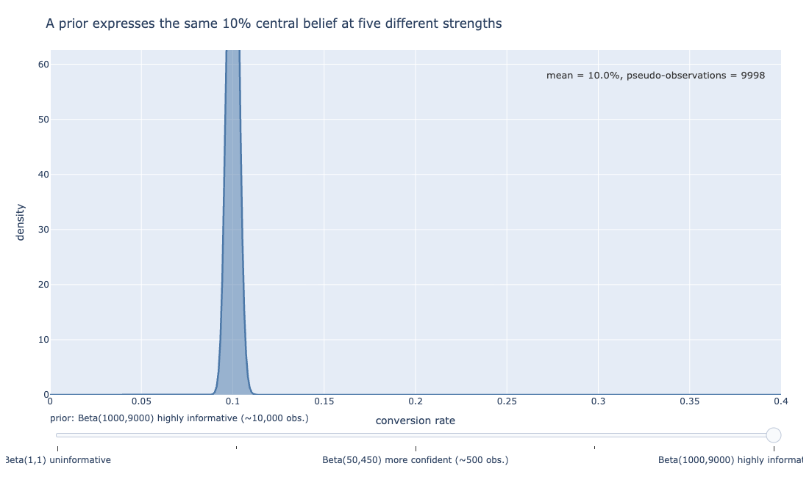
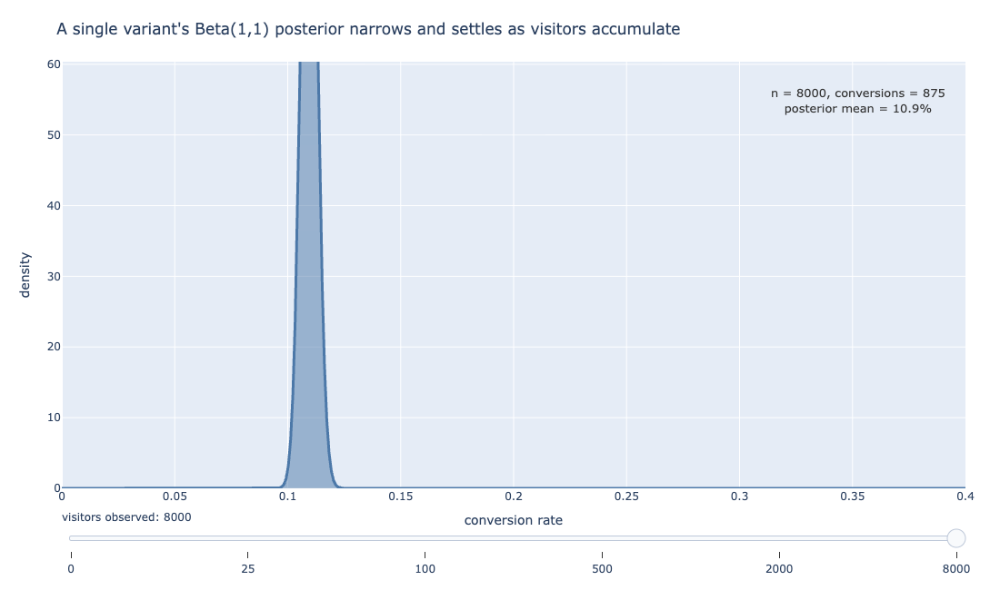
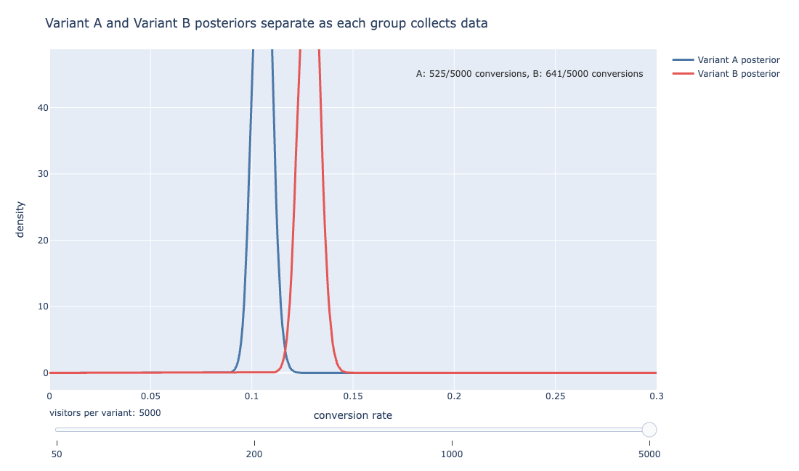
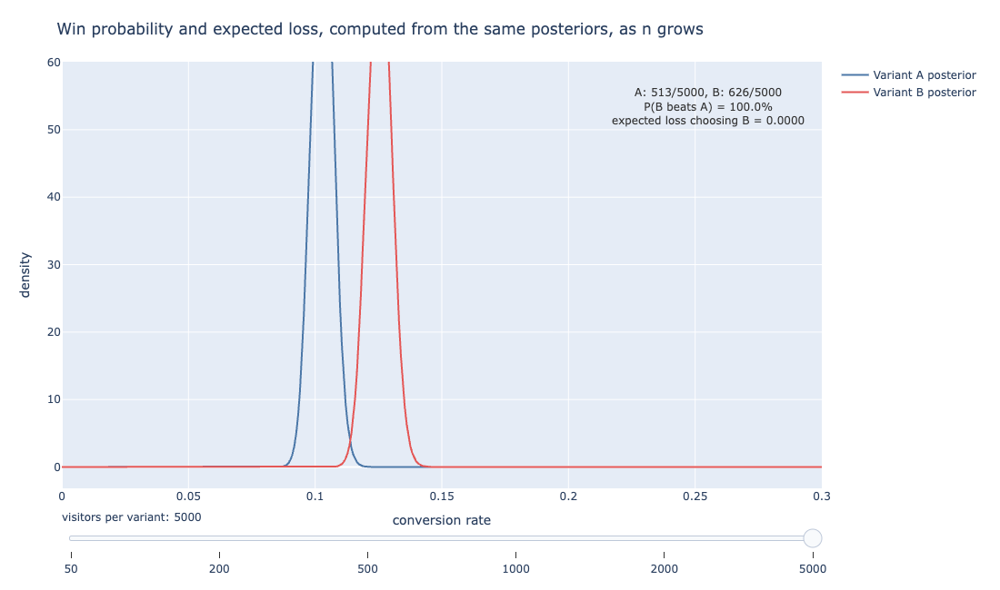
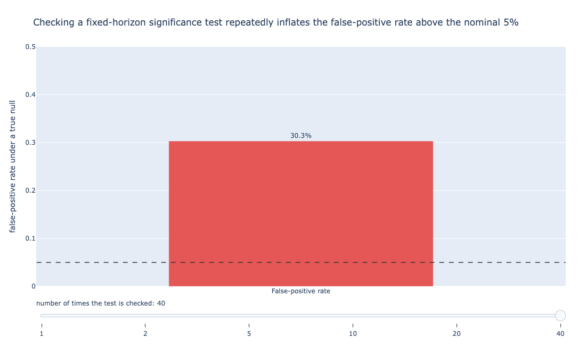

# Bayesian Experimentation for A/B Testing

At 1,000 visitors per variant, a two-proportion z-test on a checkout-button redesign returns a
p-value of 0.126. That test asks a narrow question: whether two observed conversion rates
differ by more than chance alone would plausibly explain.

Under the conventional 0.05 threshold, the 0.126 result is not significant: the frequentist
framework says stop, you cannot reject the null.

A Bayesian model fit to the same 2,000 visitors says the redesign has a 93.7% chance of beating
the original. If that 93.7% turns out to be wrong, shipping it now carries an average cost of
0.038 percentage points of conversion.

Both statements are correct. They are answers to different questions, and knowing which
question you are asking is most of what this part of the book is about.

Part 1 introduced Bayes' theorem and frequentist hypothesis testing as two separate tools. This
part treats Bayesian inference as a full alternative to the hypothesis-testing machinery from
Chapter 2.

It gives a way to run an experiment, watch it while it runs, and make a shipping decision
without waiting for a p-value to cross a line someone picked in advance.

## From Bayes' theorem to Bayesian updating

Think of updating a guess as new clues arrive in a mystery. A hunch shifts a little with each
clue, and the final guess reflects everything seen so far. Bayesian updating is that same
nudging process, done with numbers instead of hunches.

Recall Bayes' theorem from Chapter 3: it converts a prior belief and new evidence into an
updated belief. Applied to an experiment, that conversion has a name and a fixed shape.

$$P(\theta \mid \text{data}) \propto P(\text{data} \mid \theta) \times P(\theta)$$

In other words, the *posterior* (what you believe about the conversion rate $\theta$ after
seeing the data) is proportional to the *likelihood* (how probable the observed data is, for
each possible value of $\theta$) times the *prior* (what you believed about $\theta$ before
seeing any data).

This is *Bayesian updating*, and every Bayesian analysis in this chapter is one instance of
this same multiplication, applied to a checkout-button experiment instead of an abstract
$\theta$.

## Priors: how much to assume before the data arrives

A prior is just a starting guess, set before any data comes in. A cautious guess moves easily
once observations start arriving; a stubborn guess takes a lot of evidence to budge.

Suppose the checkout team is testing a redesigned button (Variant B) against the existing one
(Variant A). Before a single visitor sees either variant, a *prior* states what the team
believes about the conversion rate.

Recall from Chapter 3 that a probability distribution assigns weight to every possible value a
quantity could take. A prior does the same for the unknown conversion rate itself.

An *uninformative prior* treats every conversion rate between 0% and 100% as equally plausible.
A $\text{Beta}(1, 1)$ distribution is flat, uniform, and equivalent to having observed zero
prior data.

A *weakly informative prior* nudges the distribution toward plausible values without
pretending to certainty. A $\text{Beta}(11, 91)$ distribution behaves like 100
pseudo-observations at a 10% rate, close to what a checkout team would reasonably expect from a
button converting around 10% of visitors.

An *informative prior* goes further still, behaving like thousands of pseudo-observations
concentrated tightly around a known rate.

::: {#fig-prior-shapes}


```{=html}
<iframe src="../_generated/chapter-05-fig-beta-prior-shapes.html" width="100%" height="560"
        style="border:1px solid #ddd; border-radius:6px;" loading="lazy"></iframe>
```

Each curve puts the same 10% central belief on the x-axis (conversion rate, 0% to 40%) but
spreads that belief differently: the uninformative prior spans almost the full range, while the
highly informative prior shown here, built from about 10,000 pseudo-observations, concentrates
nearly all its density within a percentage point of 10%. The stronger the prior, the more data
it takes to move it.
:::

@fig-prior-shapes shows the same 10% central belief expressed at five different prior
strengths, from a flat uninformative prior through an increasingly confident one.

Stronger priors are not automatically better. Suppose the checkout team used an informative
prior built from a redesign three years ago that turned out to be unrepresentative of current
traffic.

That prior would actively resist what the new data is trying to say, and it would take a large
sample to overrule it.

::: {.callout-tip}
Default to a weakly informative prior unless there is a specific, defensible reason to bring in
outside information, and say so explicitly whenever a stronger prior is used.
:::

## Beta-Binomial conjugacy

Updating a guess with new evidence usually takes heavy computation. Conjugacy is a shortcut:
for certain pairings of guess and evidence, the update is nothing more than simple addition.

The reason a Beta prior is the standard choice for a conversion-rate problem is not convention
alone. It is a property called *conjugacy*.

When the likelihood of the observed data follows a binomial distribution (a fixed number of
visitors, each either converting or not) and the prior follows a Beta distribution, the
posterior is also a Beta distribution, updated by simple addition:

$$\text{Beta}(\alpha, \beta) \;\xrightarrow{\;k \text{ successes in } n \text{ trials}\;}\; \text{Beta}(\alpha + k, \;\beta + n - k)$$

In other words, starting from a $\text{Beta}(1, 1)$ prior, observing 46 conversions out of 500
visitors updates the posterior to $\text{Beta}(1 + 46, \;1 + 454) = \text{Beta}(47, 455)$.

That posterior's mean, $47 / 502 \approx 9.4\%$, sits close to the observed rate of 9.2%, and
would sit closer still to the prior's 50% mean if the sample were tiny.

No integral, no simulation, and no specialized software are required. This is
*Beta-Binomial conjugacy*, and it is the entire reason a Bayesian A/B test on conversion rates
is tractable by hand.

::: {#fig-posterior-update}


```{=html}
<iframe src="../_generated/chapter-05-fig-posterior-update.html" width="100%" height="560"
        style="border:1px solid #ddd; border-radius:6px;" loading="lazy"></iframe>
```

A single variant's posterior narrows and settles as observed visitors accumulate. Early swings
are large; by a few thousand visitors, new data barely moves it.
:::

@fig-posterior-update shows this update happening to Variant A's posterior alone as its sample
size grows from 0 to 5,000 simulated visitors, starting from a flat $\text{Beta}(1, 1)$ prior.

Watch how far the posterior mean swings between $n = 0$ (sitting at the prior's 50%, since
nothing has been observed yet) and $n = 25$. With almost no data, a handful of successes can
still pull the estimate a long way from the eventual answer near 10%.

By $n = 2{,}000$ the curve has narrowed into a tight spike. The posterior has stopped moving
much because a few more visitors can no longer outweigh the thousands that came before.

## Two variants, one decision

Picture two runners who have each finished several practice laps at slightly different times.
Win probability asks: based on those laps, how often would this runner beat the other in a
head-to-head race?

An experiment needs two posteriors, one per variant, computed the same way and compared
directly.

::: {#fig-ab-overlay}


```{=html}
<iframe src="../_generated/chapter-05-fig-posteriors-ab-overlay.html" width="100%" height="540"
        style="border:1px solid #ddd; border-radius:6px;" loading="lazy"></iframe>
```

Variant A and Variant B posteriors separate as each group collects data. By a few thousand
visitors per variant, the two curves barely overlap.
:::

@fig-ab-overlay overlays Variant A's and Variant B's posteriors as each collects more simulated
visitors, using the redesign scenario at a 10% true rate for A and a 12.5% true rate for B.

That 25% relative lift was chosen only to make the simulation worth watching. Nothing about
these specific numbers is a claim about any company's product.

At $n = 50$ per variant the two curves overlap heavily; at $n = 5{,}000$ they barely touch.

Once both posteriors exist, the practical question is no longer "is there a difference" but
"how likely is B to be the better variant, and what would it cost to be wrong."

Evan Miller's closed-form solution answers the first half directly: given Beta posteriors
$\text{Beta}(\alpha_A, \beta_A)$ for A and $\text{Beta}(\alpha_B, \beta_B)$ for B, the
probability that B beats A reduces to a finite sum over the whole-number values $\alpha$ and
$\beta$ can take [@miller2014].

That sum can be computed with ordinary loops rather than the numerical integration a less
convenient distribution pairing would require.

In practice, most teams skip the closed form and estimate the same probability by simulation:
draw a large number of samples from each posterior distribution, and count the fraction of
draws where B's sampled rate exceeds A's.

With 200,000 simulated draws per comparison, the two approaches agree to several decimal
places. The simulation approach also generalizes immediately to metrics that do not have a
convenient closed form, which is why this chapter's figures use it throughout.

## Expected loss as a stopping rule

Imagine picking between two job offers without knowing which pays better long-term. Expected
loss asks not just "which looks better" but "if this pick is wrong, how much does that mistake
typically cost?"

Win probability alone can mislead. Two experiments can both report a 95% chance that B wins
while carrying sharply different risk: one because A and B are meaningfully far apart, the
other because the sample is still small and the estimate is noisy.

Chris Stucchio's *expected loss* framework, developed for the Bayesian testing engine behind
the optimization platform VWO, answers a more honest question than "how likely is B to win": if
you choose B and you turn out to be wrong, how much do you lose, on average, in the metric that
matters [@stucchio2015]?

$$\text{Expected loss from choosing B} = E\big[\max(p_A - p_B, \;0)\big]$$

In other words, expected loss averages the size of the mistake across every simulated scenario
where A would have been the better choice, and counts zero everywhere else.

A team can set a tolerable expected-loss threshold before the experiment starts, expressed in
the units that matter to the business (percentage points of conversion, for instance).

It can then stop the experiment the moment expected loss falls below that threshold, rather
than waiting for an arbitrary significance threshold.

:::{.callout-tip}
A high win probability is not the same as low risk. Two experiments can each show a 95% win
probability for B while carrying sharply different expected loss, so set an expected-loss
threshold before an experiment starts and treat a favorable win probability alone as a reason
to keep watching, not to ship.
:::

::: {#fig-decision-metrics}


```{=html}
<iframe src="../_generated/chapter-05-fig-decision-metrics.html" width="100%" height="560"
        style="border:1px solid #ddd; border-radius:6px;" loading="lazy"></iframe>
```

Win probability and expected loss from choosing B, as the sample size grows. Expected loss
stays a steadier guide than win probability when the sample is still small.
:::

@fig-decision-metrics tracks both numbers, win probability and expected loss, across the same
growing sample sizes as the checkout-button simulation.

Note the jaggedness at small sample sizes. At $n = 50$, only two of Variant A's visitors and
five of Variant B's had converted.

That is enough for the simulation to show an 86.6% win probability for B, driven by a small
sample that happened to land unusually far apart (4% versus 10% observed, against true rates of
10% and 12.5%).

The expected-loss number at that same point, 0.0037, stays the steadier guide: it prices in how
thin the evidence still is, even while the win probability alone looks fairly persuasive.

## Continuous monitoring and the peeking problem

A common pitch for Bayesian testing is that a team can watch the dashboard at any point and act
on what it shows. A frequentist test, by contrast, inflates its false-positive rate if a team
checks the p-value early and stops the moment the p-value clears the significance threshold.

That pitch needs a qualification. Georgi Georgiev's direct rebuttal to the strong version of
this claim argues that stopping the moment a result looks favorable, and treating that as clean
evidence, still changes the question being answered.

It shifts from "what does this data say" to "what does this data say, given that I stopped
here because it looked good."

Georgiev further argues that the effect applies to frequentist and Bayesian analyses alike:
five rounds of undisciplined peeking can inflate the error rate to roughly three times the
nominal level [@georgiev2017].

::: {.callout-warning}
Checking a test repeatedly and stopping the moment it looks favorable inflates the
false-positive rate, for frequentist and Bayesian analyses alike. Five undisciplined looks can
roughly triple the error rate.
:::

::: {#fig-peeking}


```{=html}
<iframe src="../_generated/chapter-05-fig-peeking-problem.html" width="100%" height="560"
        style="border:1px solid #ddd; border-radius:6px;" loading="lazy"></iframe>
```

False-positive rate under a true null, as the number of times the test is checked grows. A
single fixed-horizon check holds the nominal 5%; five checks push it past 14%.
:::

@fig-peeking simulates this directly: two identical variants (no true difference, so any
rejection is a false positive) checked with a standard significance test at growing numbers of
look points.

Checking once holds the nominal 5% rate, by construction. Checking five times pushes the
false-positive rate to roughly 14%, close to three times the nominal level, matching Georgiev's
figure.

By 40 checks, a team that stops the moment any check looks favorable is wrong roughly three
times in ten, not one time in twenty.

This simulation runs a classical significance test at each check point. A Bayesian posterior
does not inflate this way in the same mechanical sense, since each posterior computed is a
correct statement of belief at that sample size.

But that mechanical safety does not make optional stopping free of risk.

What differs is narrower than the pitch suggests. A Bayesian posterior is a valid statement of
belief at whatever sample size it gets computed, so the number itself stays correct no matter
when a team looks.

What stays risky is optional stopping used as a decision procedure: choosing to stop
specifically because expected loss happened to dip below a comfortable-looking number at one
particular check, then treating that as though the experiment had always been designed to run
to that size.

A loss estimate computed on a whim at a favorable-looking moment is a noisier estimate than the
same loss computed against a sample size decided in advance.

Two habits keep the dashboard-watching convenience of Bayesian testing honest: setting a
minimum sample size before monitoring begins, and treating the expected-loss threshold as a
stopping rule fixed before the experiment starts, not a justification invented after the fact.

## A direct comparison against the frequentist result

The opening of this chapter quoted a two-proportion z-test on a checkout-button experiment at
the same 10% and 12.5% true rates used throughout this chapter, at $n = 1{,}000$ per variant: 95
conversions out of 1,000 for A (9.5%), 116 out of 1,000 for B (11.6%), $z = 1.53$, $p = 0.126$.

Under a standard 0.05 threshold, that result does not reject the null hypothesis that A and B
convert at the same rate.

The Bayesian posterior at that same sample size puts the win probability for B at 93.7%, with
an expected loss from choosing B of 0.038 percentage points.

The disagreement is not a contradiction. Each framework is answering the question it was built
to answer. The frequentist test asks whether the observed gap is larger than chance alone would
plausibly produce, evaluated against a fixed rejection threshold decided in advance.

The Bayesian framework asks how the team's belief about each variant's rate should update given
the data, and what a wrong decision would cost.

A team using only the p-value would keep the experiment running past 1,000 visitors per
variant, waiting for significance that may or may not arrive.

A team using expected loss might reasonably ship Variant B at $n = 500$, where expected loss
had dropped to 0.017 percentage points. The frequentist test at that same sample size had only
just crossed its own threshold ($p = 0.045$), a result fragile enough that it drifted back
above the threshold by $n = 1{,}000$.

::: {.callout-note}
At $n = 500$ the frequentist test had just crossed significance ($p = 0.045$). By
$n = 1{,}000$ it had drifted back above the threshold. A p-value near the edge of significance
can move in either direction as more data arrives.
:::

That drift is itself informative: a p-value computed at an arbitrary stopping point can move in
either direction as more data arrives, which is the motivation behind treating expected loss,
not statistical significance, as the stopping rule.

Neither framework is simply better. The frequentist test is standardized, taught everywhere,
and immediately legible to a stakeholder who has seen a p-value before. It requires a sample
size fixed in advance and a single accept-or-reject answer at the end.

The Bayesian approach gives a direct probability statement about which variant is better and a
decision rule priced in business-relevant units, and it tolerates a team checking the results
early without inflating the false-positive rate the way repeated frequentist peeking does.

It requires choosing and defending a prior, a step a frequentist test never asks for. And a
stakeholder unfamiliar with posterior distributions will need the win-probability-and-expected-loss
framing translated into plain terms before it sticks.

## Beyond conversion rates

Combining a prior guess with new data works like a weighted average: the more trustworthy
source, whichever one carries less uncertainty, pulls the final answer closer to itself.

The checkout-button test almost certainly has a second question behind the first: does the
redesign also change how much a converting visitor spends, not just whether they convert at
all?

Average order value is continuous, not binary, so Beta-Binomial conjugacy does not apply
directly. A different conjugate pairing fills the same role.

For a metric with roughly normal noise, a Normal prior on the unknown mean, combined with an
observed sample mean, produces a Normal posterior, updated by weighting each source by its
precision (the inverse of its variance).

$$\tau_{\text{post}} = \tau_{\text{prior}} + n \tau_{\text{data}}, \qquad
\mu_{\text{post}} = \frac{\tau_{\text{prior}} \mu_{\text{prior}} + n \tau_{\text{data}} \bar{x}}{\tau_{\text{post}}}$$

Here $\tau_{\text{prior}}$ and $\tau_{\text{data}}$ are the precisions of the prior belief and
of a single observation, $n$ is the sample size, $\mu_{\text{prior}}$ is the prior mean, and
$\bar{x}$ is the observed sample mean.

In other words, the posterior precision $\tau_{\text{post}}$ is just the prior's precision plus
$n$ copies of the data's precision, since $n$ independent observations are $n$ times as
informative as one.

The posterior mean $\mu_{\text{post}}$ is a weighted average of the prior mean and the sample
mean, with each one weighted by how much precision it contributes.

A prior with high precision (a narrow, confident guess) barely moves even when the sample mean
disagrees with it. A prior with low precision (a wide, uncertain guess) gets pulled toward the
sample mean almost immediately.

Suppose the team's pre-launch benchmarking suggests an average order value around \$42, with
enough uncertainty to express as a prior standard deviation of \$5.

After 500 converting visitors under Variant B post an observed mean of \$44.10 with a sample
standard deviation of \$18, the posterior mean settles close to \$44.05.

The result is pulled only slightly toward the prior's \$42, because the sample of 500 carries
far more precision than the prior did. This is the same prior-times-likelihood-equals-posterior
logic from earlier in the chapter, applied to a different distribution family.

That said, plenty of continuous metrics do not stay this well behaved. Order value tends to be
right-skewed in the same way the latency data from Chapter 1 was, carries outliers from bulk
orders, and often needs a model structure the simple Normal-Normal pairing cannot express.

This includes cases such as separate effects per customer segment or a likelihood that is not
normal at all. This is where conjugacy runs out and numerical methods take over.

`pymc` and `arviz`, both listed among this book's dependencies, exist to draw posterior samples
via Markov chain Monte Carlo once a model no longer has a closed-form answer.

Every figure in this chapter needed nothing more than arithmetic, because Beta-Binomial and
Normal-Normal conjugacy both had closed-form solutions. A model with correlated segment-level
effects or a skewed, non-normal outcome usually will not.

## The limits of Bayesian inference

Nothing in this chapter repairs the confounding problem from Chapter 1's kidney-stone study. If
the checkout-button experiment happened to assign more mobile visitors to Variant B, and mobile
visitors convert differently regardless of button design, a Bayesian analysis of the combined
results is exposed to the identical Simpson's-paradox reversal a frequentist analysis would be.

Conjugate priors, closed-form win probabilities, and expected loss all assume the underlying
experiment was designed well: randomized assignment, a stable population, and no lurking
variable steering which visitors saw which variant.

::: {.callout-important}
Bayesian methods change how uncertainty is quantified. They do not fix a poorly designed
experiment. Randomized assignment and a stable population still come first.
:::

Bayesian methods change how uncertainty about a well-designed experiment gets quantified and
acted on. Designing the experiment correctly still comes first.

## References {.unnumbered}

::: {#refs}
:::
