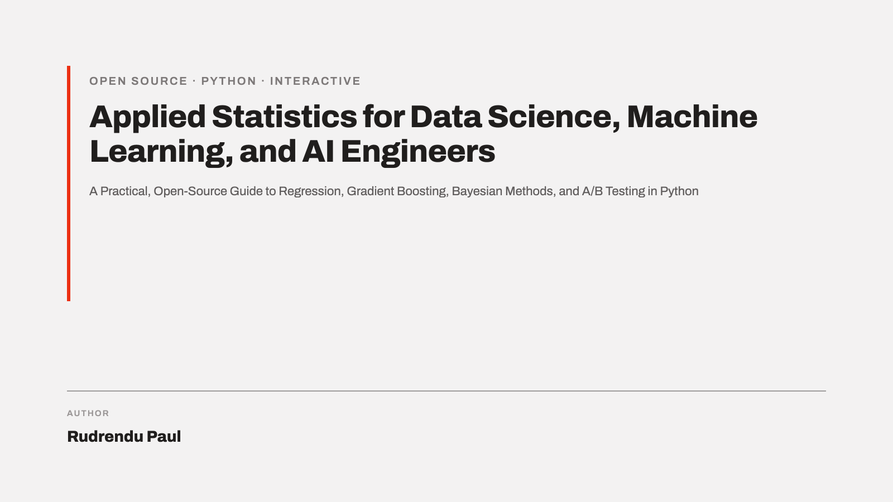

{.book-cover-banner fig-alt="Book cover: Applied Statistics for Data Science, Machine Learning, and AI Engineers"}

# Preface {.unnumbered}

```{=html}
<p style="margin-top:-0.5rem;">
  <a href="https://github.com/RudrenduPaul" style="display:inline-flex;align-items:center;gap:0.4rem;text-decoration:none;color:inherit;">
    <svg height="18" width="18" viewBox="0 0 16 16" fill="currentColor" aria-hidden="true">
      <path d="M8 0C3.58 0 0 3.58 0 8c0 3.54 2.29 6.53 5.47 7.59.4.07.55-.17.55-.38 0-.19-.01-.82-.01-1.49-2.01.37-2.53-.49-2.69-.94-.09-.23-.48-.94-.82-1.13-.28-.15-.68-.52-.01-.53.63-.01 1.08.58 1.23.82.72 1.21 1.87.87 2.33.66.07-.52.28-.87.51-1.07-1.78-.2-3.64-.89-3.64-3.95 0-.87.31-1.59.82-2.15-.08-.2-.36-1.02.08-2.12 0 0 .67-.21 2.2.82.64-.18 1.32-.27 2-.27.68 0 1.36.09 2 .27 1.53-1.04 2.2-.82 2.2-.82.44 1.1.16 1.92.08 2.12.51.56.82 1.27.82 2.15 0 3.07-1.87 3.75-3.65 3.95.29.25.54.73.54 1.48 0 1.07-.01 1.93-.01 2.2 0 .21.15.46.55.38A8.01 8.01 0 0 0 16 8c0-4.42-3.58-8-8-8z"></path>
    </svg>
    <span>github.com/RudrenduPaul</span>
  </a>
</p>
```

This book is a practical statistics handbook for data scientists and engineers who need to
run, read, and defend an experiment, not just pass a stats exam. Every chapter pairs the
underlying theory with a worked example built around one running dataset: simulated response
times for a checkout API, followed through descriptive statistics, hypothesis testing,
regression, tree-based models, and a Bayesian A/B test.

Every figure in the book is a Plotly chart with a slider. Drag it, and the chart updates in
your browser, no server and no setup required. The source for every chapter is plain Markdown;
the source for every figure is a plain Python script in `chapters/`, so nothing here is a
black box, and every chart is regenerable from the code sitting right next to the prose that
uses it.

This book is free and open source.

## See it in action

Three of the charts that appear later in the book, live and interactive right now. Drag any
slider below before reading a word of Chapter 1.

::: {#fig-index-literary-digest}
```{=html}
<iframe src="_generated/chapter-01-fig-literary-digest.html" width="100%" height="560"
        style="border:1px solid #ddd; border-radius:6px;" loading="lazy"></iframe>
```

The 1936 Literary Digest poll called the election for Landon at 57% to 43%, from a
ten-million-person sample. Roosevelt won. Drag the slider between the poll's prediction and
the result: Chapter 1 walks through why a sample that size still missed the outcome by 24
points.
:::

::: {#fig-index-simpsons-paradox}
```{=html}
<iframe src="_generated/chapter-01-fig-simpsons-paradox.html" width="100%" height="560"
        style="border:1px solid #ddd; border-radius:6px;" loading="lazy"></iframe>
```

Charig et al.'s 1986 kidney-stone data: Treatment A wins on both stone sizes taken
separately. Drag the slider to pool the two groups together, and Treatment B wins instead.
Chapter 1 uses this reversal to introduce Simpson's paradox.
:::

::: {#fig-index-bayesian-ridge}
```{=html}
<iframe src="_generated/chapter-04-fig-bayesian-ridge.html" width="100%" height="560"
        style="border:1px solid #ddd; border-radius:6px;" loading="lazy"></iframe>
```

Shrink the prior variance with the slider and watch the posterior over a regression
coefficient narrow and slide toward zero. Chapter 4 shows this is the same shrinkage Ridge
regression's penalty term produces, derived instead from a Gaussian prior.
:::

## Frequently asked questions

**Is this book free?** Yes. The full text is free to read online, with no paywall, signup, or account.

**Can I reuse the text or figures?** Yes, under CC BY 4.0 (text) and MIT (code), with attribution to Rudrendu Paul.

**Does reading this book require a Jupyter kernel or a running Python server?** No. Every figure is pre-rendered to a self-contained interactive HTML page, so the book works from a static file server and needs nothing more than a browser.

**Does this book cover statistical significance, p-values, and alpha?** Yes. Chapter 2 covers the p-value, the significance threshold (alpha), and warns against the p-value-as-probability-of-truth misreading. Chapter 4 separately covers statistical vs. practical significance.

**Does this book cover Type I and Type II errors and statistical power?** Yes. Chapter 2 covers Type I error, Type II error, the trade-off between them, and statistical power as a function of sample size and effect size, each with an interactive figure.

**Does this book cover precision, recall, F1, and ROC/AUC?** Yes. Chapter 7 has a dedicated section on evaluating a classifier, with an interactive confusion-matrix figure where dragging the classification threshold live-updates precision, recall, F1, and the ROC curve.

**What is the difference between a p-value and the probability the null hypothesis is true?** A p-value is computed by assuming the null hypothesis is true, and it measures how surprising the observed data would be under that assumption. It does not measure the probability that the hypothesis itself is true. Chapter 2 covers this distinction directly.

**What is the difference between a confidence interval and a Bayesian credible interval?** A confidence interval is a statement about a repeated procedure: 95% of intervals generated across repeated experiments would contain the true value. A credible interval is a direct probability statement given the observed data: a 95% credible interval means a 95% posterior probability the parameter lies in that range. Chapter 9 covers both side by side.

**How does Ridge regression relate to a Gaussian prior?** Ridge regression's L2 penalty is mathematically equivalent to placing a Gaussian prior on the regression coefficients and taking the posterior mode. Chapter 4's preview and Chapter 9's full treatment both derive this.

**How does Bayesian A/B testing differ from a classical significance test?** Chapter 14 covers this end to end: Bayesian A/B testing produces a posterior distribution over each variant's conversion rate, a win probability, and an expected-loss stopping rule, instead of a single p-value.

**Why does a random forest split on only a random subset of predictors at each split?** Restricting each split to a random subset of predictors (Chapter 7) forces trees to occasionally split on weaker predictors instead of always defaulting to the strongest one, decorrelating the trees so averaging reduces variance more effectively.

**Why are boosted trees kept shallow while random forest trees are grown deep?** A random forest (Chapter 7) controls variance by averaging many deep, individually overfit trees. A boosted model (Chapter 8) keeps its trees shallow on purpose, often 2 to 6 levels, so no single tree overcorrects.

```{=html}
<script type="application/ld+json">
{
  "@context": "https://schema.org",
  "@type": "FAQPage",
  "mainEntity": [
    {"@type": "Question", "name": "Is this book free?", "acceptedAnswer": {"@type": "Answer", "text": "Yes. The full text is free to read online, with no paywall, signup, or account."}},
    {"@type": "Question", "name": "Can I reuse the text or figures?", "acceptedAnswer": {"@type": "Answer", "text": "Yes, under CC BY 4.0 (text) and MIT (code), with attribution to Rudrendu Paul."}},
    {"@type": "Question", "name": "Does reading this book require a Jupyter kernel or a running Python server?", "acceptedAnswer": {"@type": "Answer", "text": "No. Every figure is pre-rendered to a self-contained interactive HTML page, so the book works from a static file server and needs nothing more than a browser."}},
    {"@type": "Question", "name": "Does this book cover statistical significance, p-values, and alpha?", "acceptedAnswer": {"@type": "Answer", "text": "Yes. Chapter 2 covers the p-value, the significance threshold (alpha), and warns against the p-value-as-probability-of-truth misreading. Chapter 4 separately covers statistical vs. practical significance."}},
    {"@type": "Question", "name": "Does this book cover Type I and Type II errors and statistical power?", "acceptedAnswer": {"@type": "Answer", "text": "Yes. Chapter 2 covers Type I error, Type II error, the trade-off between them, and statistical power as a function of sample size and effect size, each with an interactive figure."}},
    {"@type": "Question", "name": "Does this book cover precision, recall, F1, and ROC/AUC?", "acceptedAnswer": {"@type": "Answer", "text": "Yes. Chapter 7 has a dedicated section on evaluating a classifier, with an interactive confusion-matrix figure where dragging the classification threshold live-updates precision, recall, F1, and the ROC curve."}},
    {"@type": "Question", "name": "What is the difference between a p-value and the probability the null hypothesis is true?", "acceptedAnswer": {"@type": "Answer", "text": "A p-value is computed by assuming the null hypothesis is true, and it measures how surprising the observed data would be under that assumption. It does not measure the probability that the hypothesis itself is true. Chapter 2 covers this distinction directly."}},
    {"@type": "Question", "name": "What is the difference between a confidence interval and a Bayesian credible interval?", "acceptedAnswer": {"@type": "Answer", "text": "A confidence interval is a statement about a repeated procedure: 95% of intervals generated across repeated experiments would contain the true value. A credible interval is a direct probability statement given the observed data: a 95% credible interval means a 95% posterior probability the parameter lies in that range. Chapter 9 covers both side by side."}},
    {"@type": "Question", "name": "How does Ridge regression relate to a Gaussian prior?", "acceptedAnswer": {"@type": "Answer", "text": "Ridge regression's L2 penalty is mathematically equivalent to placing a Gaussian prior on the regression coefficients and taking the posterior mode. Chapter 4's preview and Chapter 9's full treatment both derive this."}},
    {"@type": "Question", "name": "How does Bayesian A/B testing differ from a classical significance test?", "acceptedAnswer": {"@type": "Answer", "text": "Chapter 14 covers this end to end: Bayesian A/B testing produces a posterior distribution over each variant's conversion rate, a win probability, and an expected-loss stopping rule, instead of a single p-value."}},
    {"@type": "Question", "name": "Why does a random forest split on only a random subset of predictors at each split?", "acceptedAnswer": {"@type": "Answer", "text": "Restricting each split to a random subset of predictors (Chapter 7) forces trees to occasionally split on weaker predictors instead of always defaulting to the strongest one, decorrelating the trees so averaging reduces variance more effectively."}},
    {"@type": "Question", "name": "Why are boosted trees kept shallow while random forest trees are grown deep?", "acceptedAnswer": {"@type": "Answer", "text": "A random forest (Chapter 7) controls variance by averaging many deep, individually overfit trees. A boosted model (Chapter 8) keeps its trees shallow on purpose, often 2 to 6 levels, so no single tree overcorrects."}}
  ]
}
</script>
```
